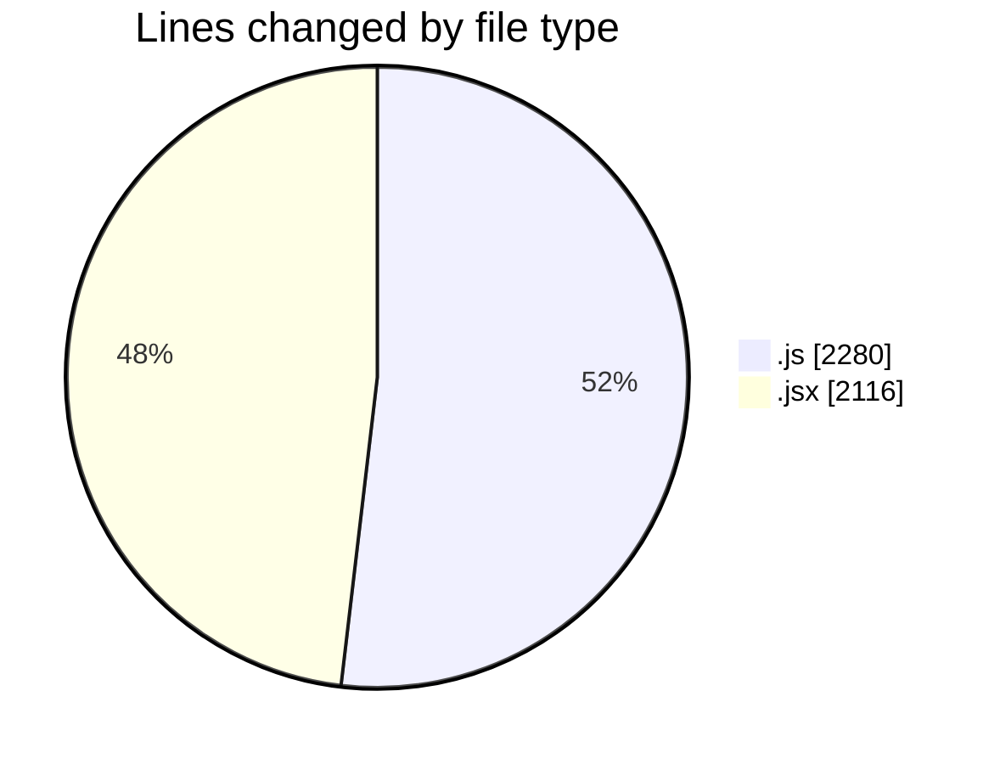
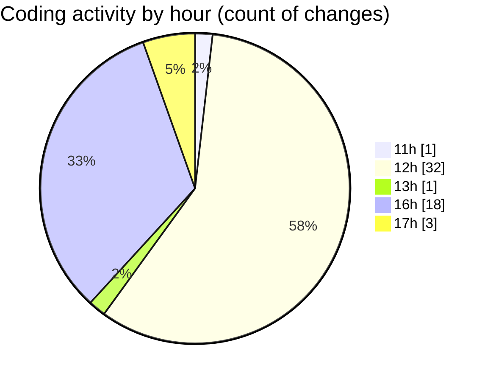

# nxtqube_webapp - Activity Summary 

## Overall Statistics

| Stat                   | Value                                                             |
| ---------------------- | ----------------------------------------------------------------- |
| **Lines Added** (➕)   | 3577                                          |
| **Lines Removed** (➖) | 819                                        |
| **Net Change** (↕)    | 2758                |
| **Active Time** (⌚)   | 58 minutes |

## Modified Files
- **drawGrid.js** (+1465, -815)
- **Map.jsx** (+716, -0)
- **Mission.jsx** (+164, -3)
- **ManageMission.jsx** (+311, -0)
- **createMissionHome.jsx** (+582, -0)
- **createGridMission.jsx** (+339, -1)

## Visualizations

### By File Type (Lines Changed)

### By Hour (Estimated Activity Count)

> **Last Updated:** 01/09/2025, 17:43:06