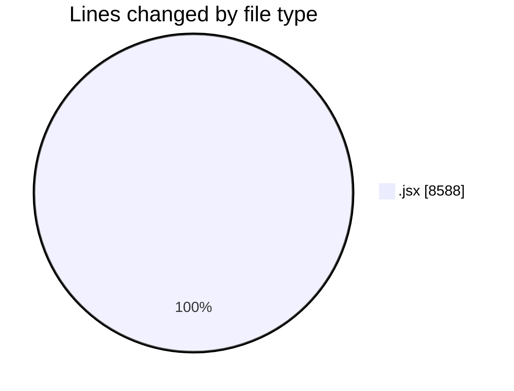
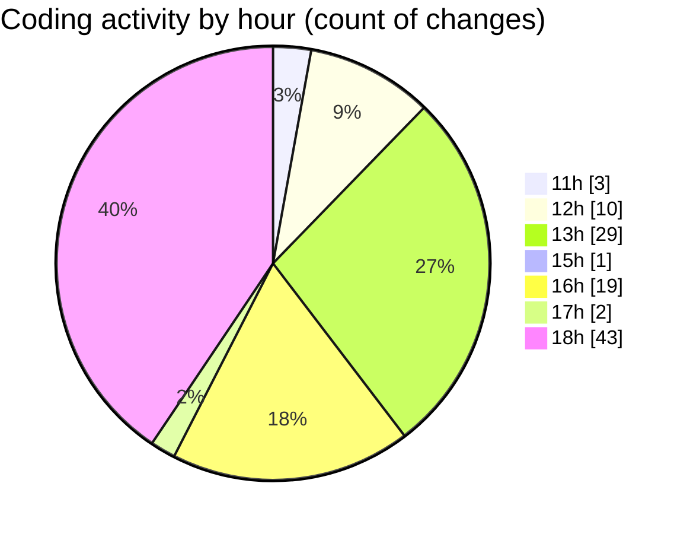

# nxtqube_webapp - Activity Summary 

## Overall Statistics

| Stat                   | Value                                                             |
| ---------------------- | ----------------------------------------------------------------- |
| **Lines Added** (➕)   | 5437                                          |
| **Lines Removed** (➖) | 3151                                        |
| **Net Change** (↕)    | 2286                |
| **Active Time** (⌚)   | 128 minutes |

## Modified Files
- **createGridMission.jsx** (+3794, -2634)
- **WaypointAction.jsx** (+321, -2)
- **Drone.jsx** (+485, -453)
- **Map.jsx** (+837, -62)

## Visualizations

### By File Type (Lines Changed)

### By Hour (Estimated Activity Count)

> **Last Updated:** 09/09/2025, 18:45:46