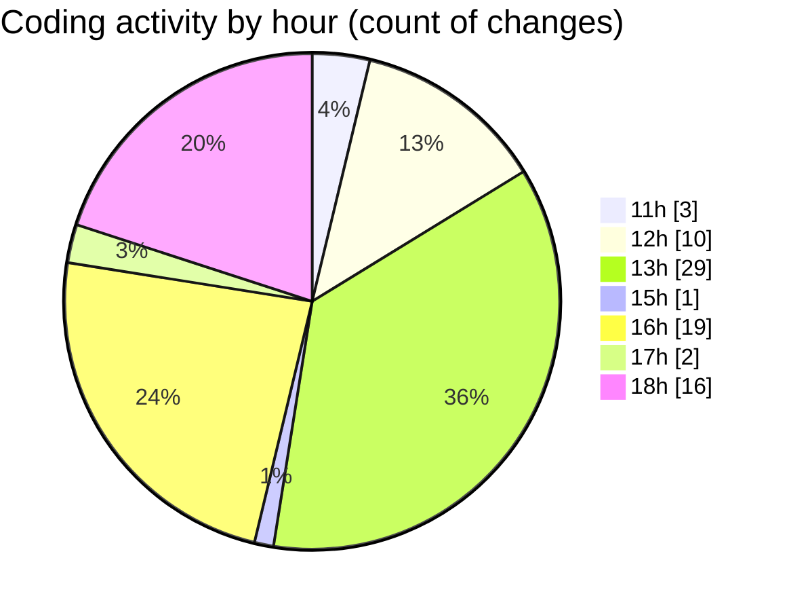

# nxtqube_webapp - Activity Summary 

## Overall Statistics

| Stat                   | Value                                                             |
| ---------------------- | ----------------------------------------------------------------- |
| **Lines Added** (➕)   | 5318                                          |
| **Lines Removed** (➖) | 3089                                        |
| **Net Change** (↕)    | 2229                |
| **Active Time** (⌚)   | 100 minutes |

## Modified Files
- **createGridMission.jsx** (+3794, -2634)
- **WaypointAction.jsx** (+321, -2)
- **Drone.jsx** (+485, -453)
- **Map.jsx** (+718, -0)

## Visualizations

### By File Type (Lines Changed)

### By Hour (Estimated Activity Count)

> **Last Updated:** 09/09/2025, 18:25:05