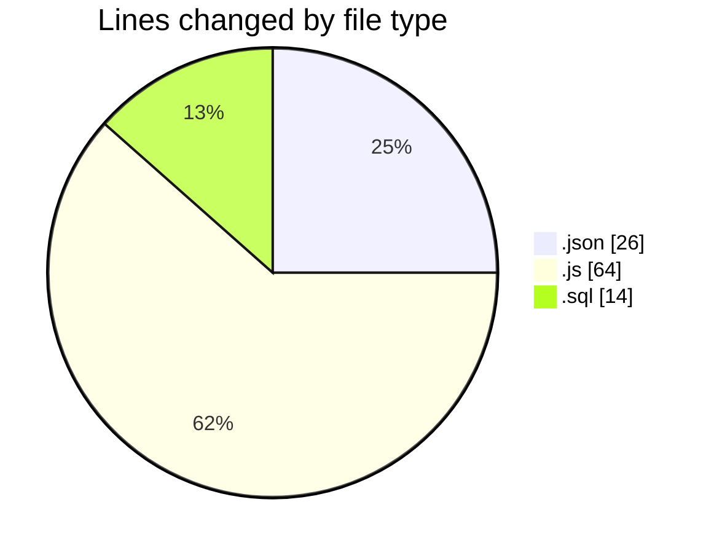
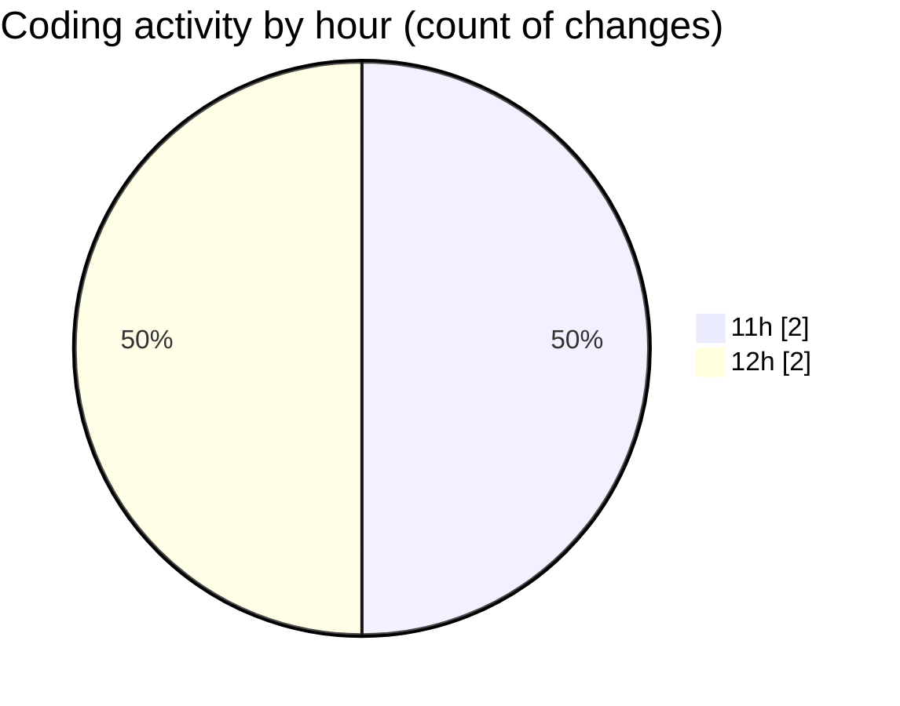

# cashCalC - Activity Summary 

## Overall Statistics

| Stat                   | Value                                                             |
| ---------------------- | ----------------------------------------------------------------- |
| **Lines Added** (➕)   | 104                                          |
| **Lines Removed** (➖) | 0                                        |
| **Net Change** (↕)    | 104                |
| **Active Time** (⌚)   | 2 minutes |

## Modified Files
- **package.json** (+26, -0)
- **server.js** (+23, -0)
- **init.sql** (+14, -0)
- **calculations.js** (+41, -0)

## Visualizations

### By File Type (Lines Changed)

### By Hour (Estimated Activity Count)

> **Last Updated:** 10/09/2025, 12:20:13