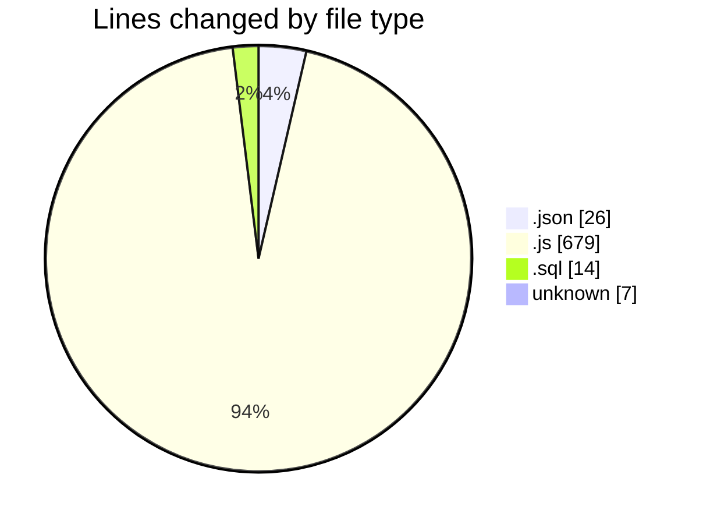
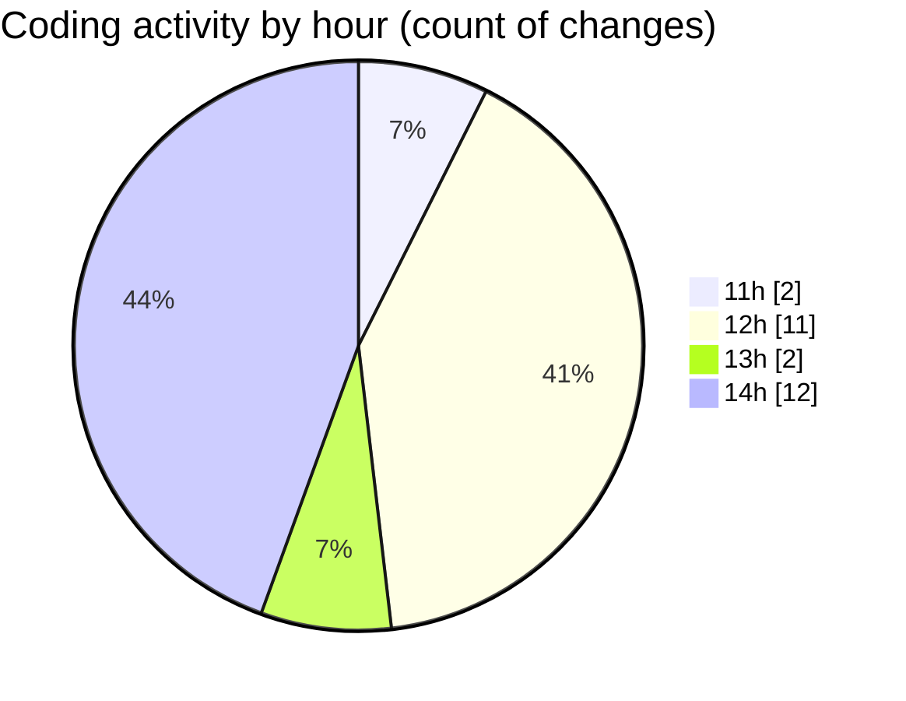

# cashCalC - Activity Summary 

## Overall Statistics

| Stat                   | Value                                                             |
| ---------------------- | ----------------------------------------------------------------- |
| **Lines Added** (➕)   | 685                                          |
| **Lines Removed** (➖) | 41                                        |
| **Net Change** (↕)    | 644                |
| **Active Time** (⌚)   | 36 minutes |

## Modified Files
- **package.json** (+26, -0)
- **server.js** (+30, -0)
- **init.sql** (+14, -0)
- **calculations.js** (+41, -31)
- **database.js** (+10, -0)
- **Transaction.js** (+34, -0)
- **transactionController.js** (+42, -0)
- **.env** (+7, -0)
- **authController.js** (+32, -0)
- **api.js** (+66, -0)
- **NavBar.js** (+50, -0)
- **TabNavigation.js** (+151, -8)
- **App.js** (+51, -1)
- **SideDrawer.js** (+131, -1)

## Visualizations

### By File Type (Lines Changed)

### By Hour (Estimated Activity Count)

> **Last Updated:** 10/09/2025, 14:20:13