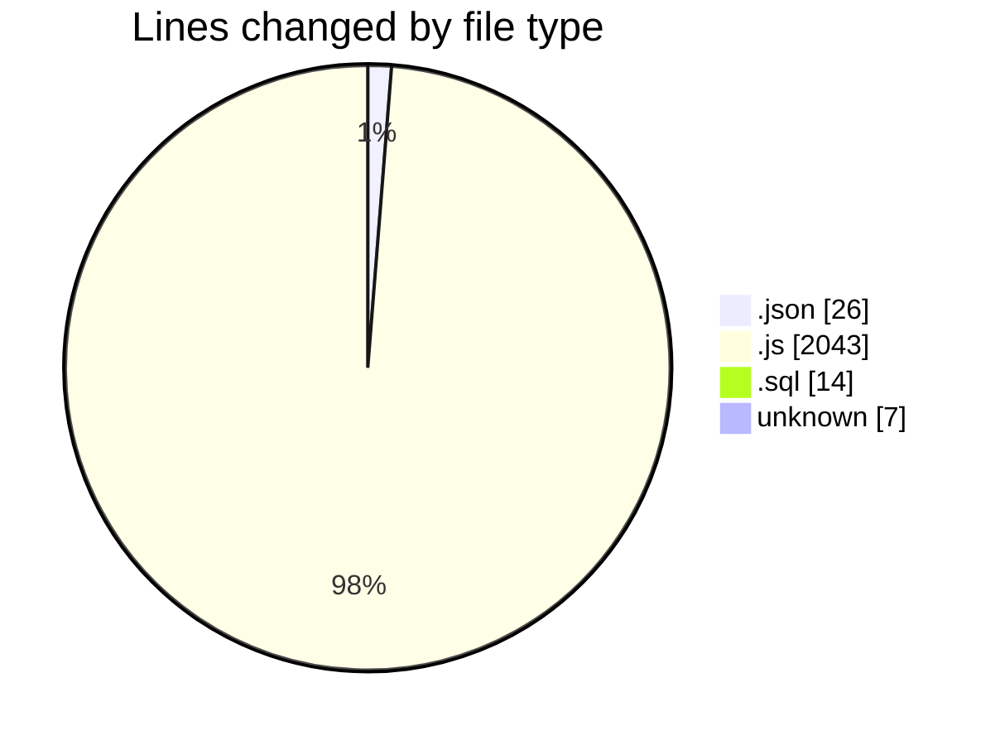
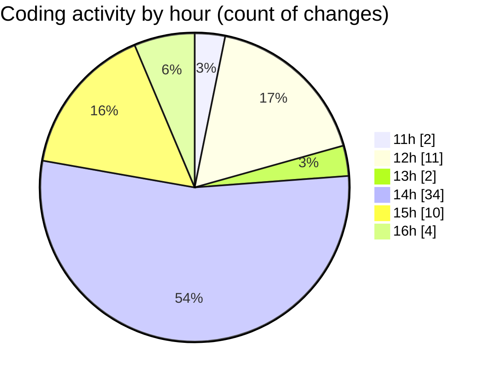

# cashCalC - Activity Summary 

## Overall Statistics

| Stat                   | Value                                                             |
| ---------------------- | ----------------------------------------------------------------- |
| **Lines Added** (➕)   | 2022                                          |
| **Lines Removed** (➖) | 68                                        |
| **Net Change** (↕)    | 1954                |
| **Active Time** (⌚)   | 92 minutes |

## Modified Files
- **package.json** (+26, -0)
- **server.js** (+30, -0)
- **init.sql** (+14, -0)
- **calculations.js** (+41, -31)
- **database.js** (+10, -0)
- **Transaction.js** (+36, -0)
- **transactionController.js** (+122, -8)
- **.env** (+7, -0)
- **authController.js** (+32, -0)
- **api.js** (+66, -0)
- **NavBar.js** (+50, -0)
- **TabNavigation.js** (+151, -8)
- **App.js** (+55, -5)
- **SideDrawer.js** (+149, -16)
- **CashScreen.js** (+823, -0)
- **LogsScreen.js** (+364, -0)
- **TransactionContext.js** (+46, -0)

## Visualizations

### By File Type (Lines Changed)

### By Hour (Estimated Activity Count)

> **Last Updated:** 10/09/2025, 16:09:06