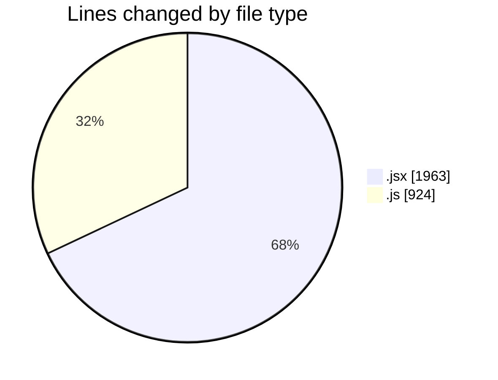
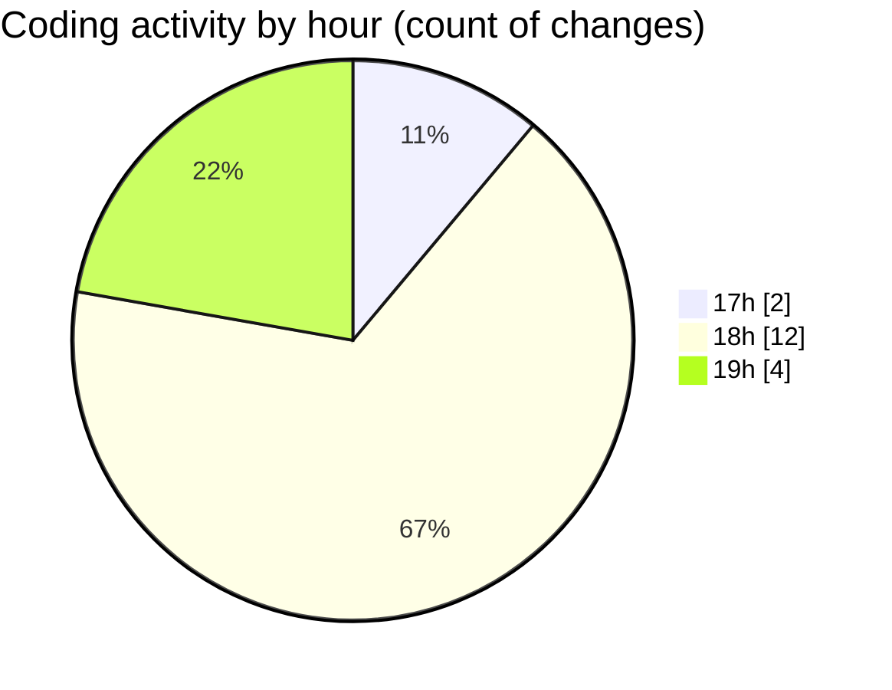

# nxtqube_webapp - Activity Summary 

## Overall Statistics

| Stat                   | Value                                                             |
| ---------------------- | ----------------------------------------------------------------- |
| **Lines Added** (➕)   | 2864                                          |
| **Lines Removed** (➖) | 23                                        |
| **Net Change** (↕)    | 2841                |
| **Active Time** (⌚)   | 14 minutes |

## Modified Files
- **Map.jsx** (+786, -5)
- **drawGrid.js** (+906, -18)
- **createGridMission.jsx** (+1172, -0)

## Visualizations

### By File Type (Lines Changed)

### By Hour (Estimated Activity Count)

> **Last Updated:** 10/09/2025, 19:09:13