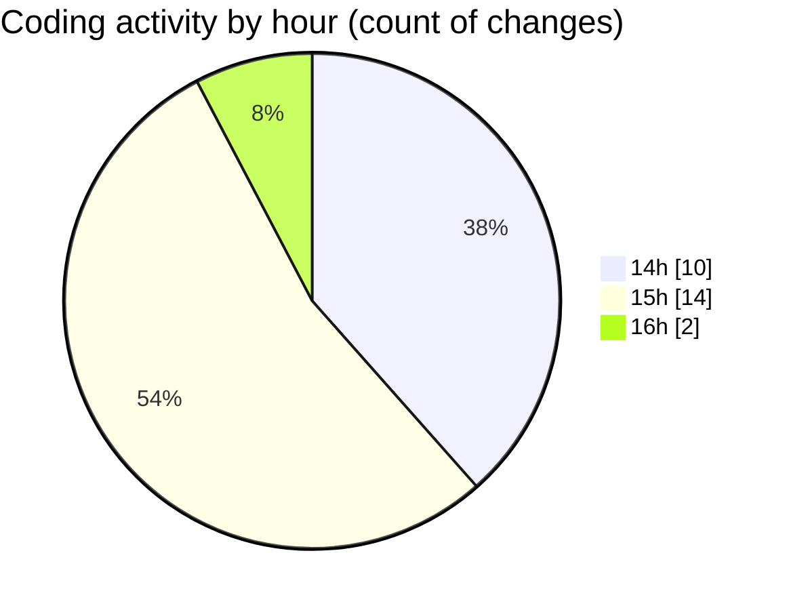

# nxtqube_webapp - Activity Summary 

## Overall Statistics

| Stat                   | Value                                                             |
| ---------------------- | ----------------------------------------------------------------- |
| **Lines Added** (➕)   | 2368                                          |
| **Lines Removed** (➖) | 512                                        |
| **Net Change** (↕)    | 1856                |
| **Active Time** (⌚)   | 39 minutes |

## Modified Files
- **drawGrid.js** (+1309, -422)
- **Map.jsx** (+781, -0)
- **camera_specs.js** (+47, -2)
- **drone.model.js** (+186, -88)
- **camera_specs.model.js** (+45, -0)

## Visualizations

### By File Type (Lines Changed)

### By Hour (Estimated Activity Count)

> **Last Updated:** 11/09/2025, 16:08:49