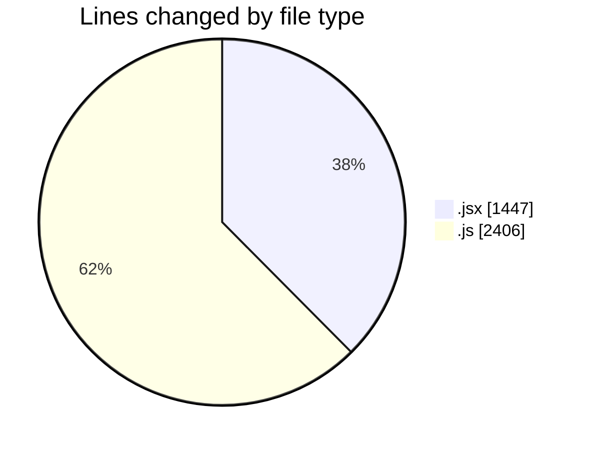
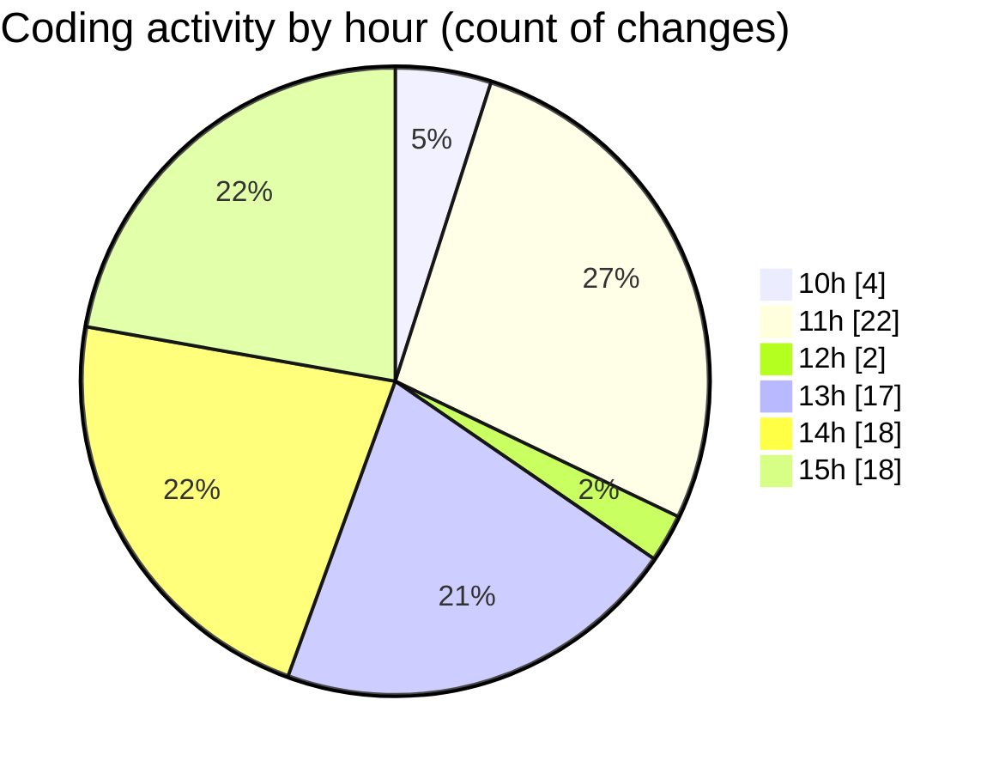

# nxtqube_webapp - Activity Summary 

## Overall Statistics

| Stat                   | Value                                                             |
| ---------------------- | ----------------------------------------------------------------- |
| **Lines Added** (➕)   | 3122                                          |
| **Lines Removed** (➖) | 731                                        |
| **Net Change** (↕)    | 2391                |
| **Active Time** (⌚)   | 103 minutes |

## Modified Files
- **createGridMission.jsx** (+1244, -5)
- **Mission.jsx** (+178, -20)
- **drawGrid.js** (+1700, -706)

## Visualizations

### By File Type (Lines Changed)

### By Hour (Estimated Activity Count)

> **Last Updated:** 15/09/2025, 15:33:14