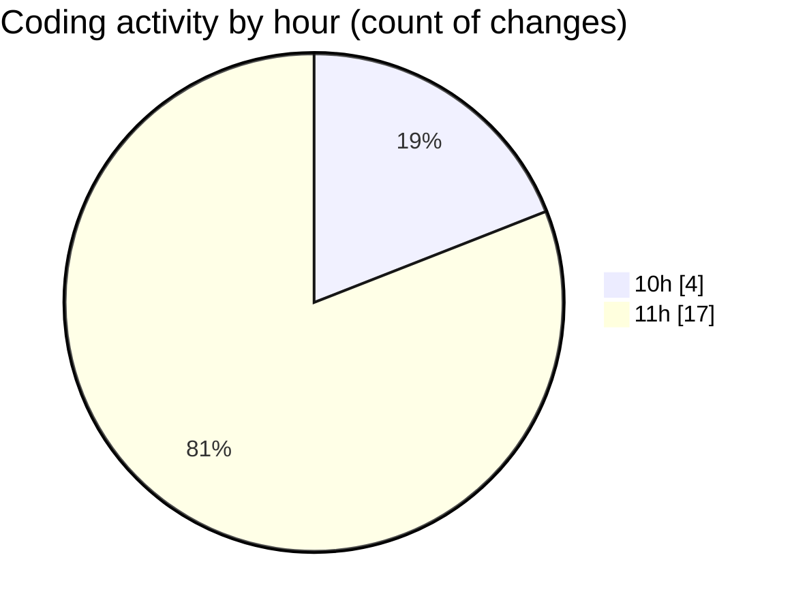

# nxtqube_webapp - Activity Summary 

## Overall Statistics

| Stat                   | Value                                                             |
| ---------------------- | ----------------------------------------------------------------- |
| **Lines Added** (➕)   | 2270                                          |
| **Lines Removed** (➖) | 12                                        |
| **Net Change** (↕)    | 2258                |
| **Active Time** (⌚)   | 22 minutes |

## Modified Files
- **createGridMission.jsx** (+1209, -5)
- **Mission.jsx** (+178, -7)
- **drawGrid.js** (+883, -0)

## Visualizations

### By File Type (Lines Changed)

### By Hour (Estimated Activity Count)

> **Last Updated:** 15/09/2025, 11:49:44