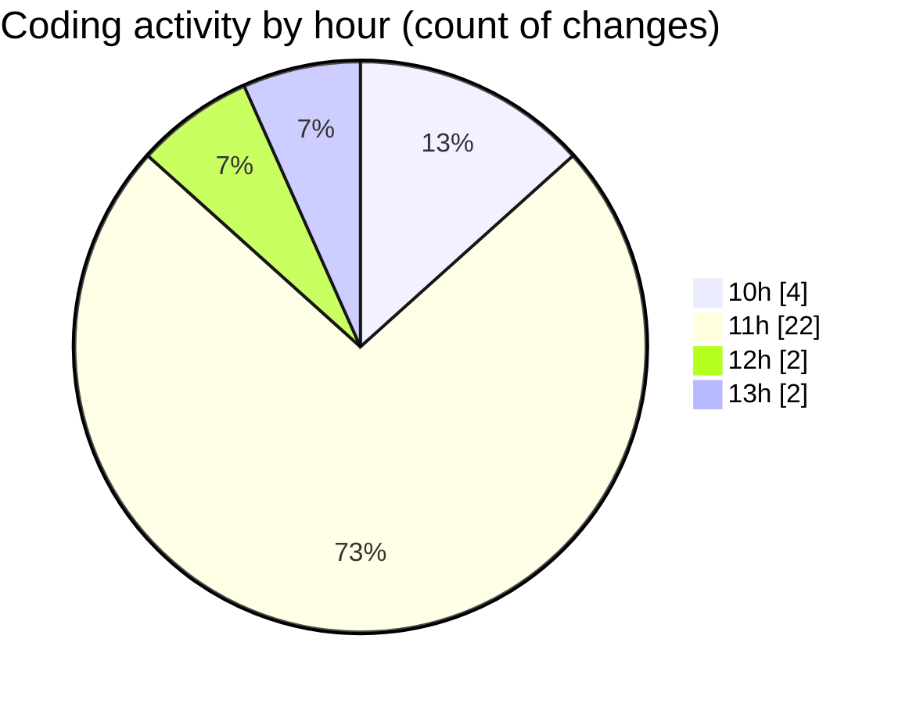

# nxtqube_webapp - Activity Summary 

## Overall Statistics

| Stat                   | Value                                                             |
| ---------------------- | ----------------------------------------------------------------- |
| **Lines Added** (➕)   | 2301                                          |
| **Lines Removed** (➖) | 25                                        |
| **Net Change** (↕)    | 2276                |
| **Active Time** (⌚)   | 31 minutes |

## Modified Files
- **createGridMission.jsx** (+1232, -5)
- **Mission.jsx** (+178, -20)
- **drawGrid.js** (+891, -0)

## Visualizations

### By File Type (Lines Changed)

### By Hour (Estimated Activity Count)

> **Last Updated:** 15/09/2025, 13:09:44