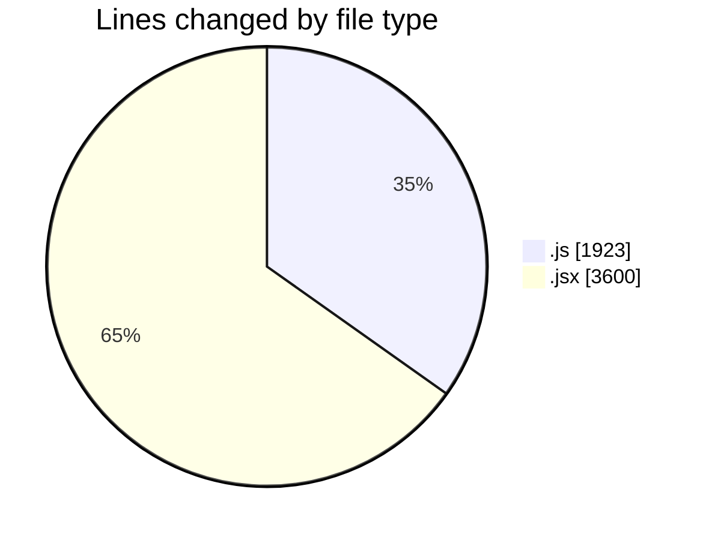
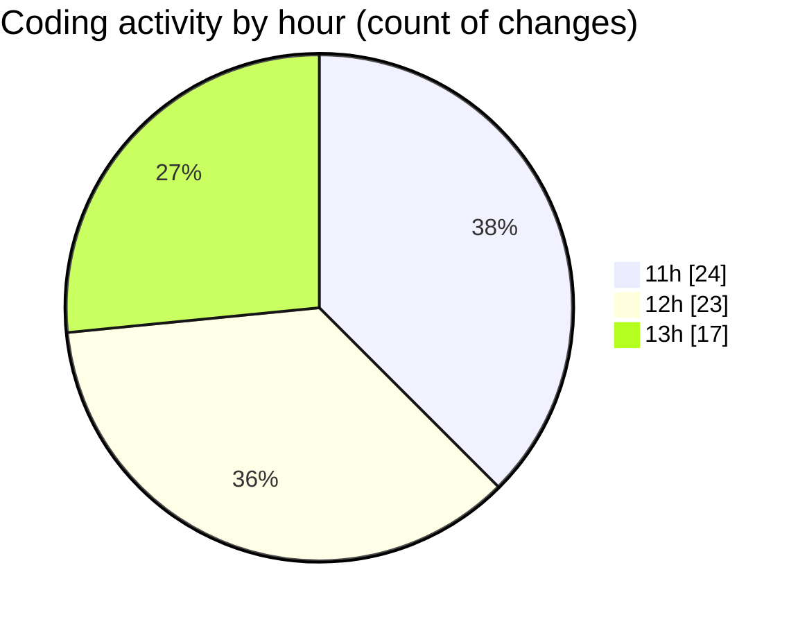

# nxtqube_webapp - Activity Summary 

## Overall Statistics

| Stat                   | Value                                                             |
| ---------------------- | ----------------------------------------------------------------- |
| **Lines Added** (➕)   | 5321                                          |
| **Lines Removed** (➖) | 202                                        |
| **Net Change** (↕)    | 5119                |
| **Active Time** (⌚)   | 73 minutes |

## Modified Files
- **drawGrid.js** (+998, -4)
- **Map.jsx** (+934, -34)
- **parentMissions.modal.js** (+94, -52)
- **gridMission.modal.js** (+43, -42)
- **mission.modal.js** (+64, -4)
- **mission.controller.js** (+319, -23)
- **createMissionHome.jsx** (+639, -1)
- **video.controller.js** (+153, -15)
- **routes.js** (+98, -14)
- **DockVideo.jsx** (+1067, -4)
- **Drone.jsx** (+46, -6)
- **MissionInfo.jsx** (+546, -3)
- **droneCommandHandler.jsx** (+320, -0)

## Visualizations

### By File Type (Lines Changed)

### By Hour (Estimated Activity Count)

> **Last Updated:** 18/09/2025, 13:26:17