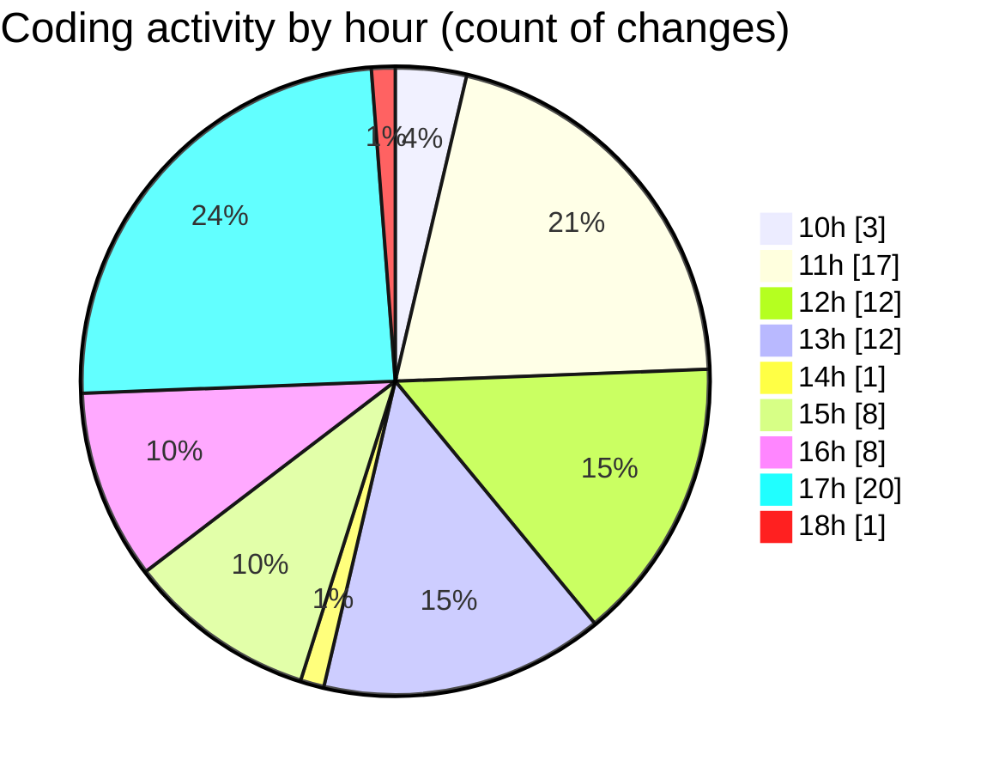

# nxtqube_webapp - Activity Summary 

## Overall Statistics

| Stat                   | Value                                                             |
| ---------------------- | ----------------------------------------------------------------- |
| **Lines Added** (➕)   | 4331                                          |
| **Lines Removed** (➖) | 239                                        |
| **Net Change** (↕)    | 4092                |
| **Active Time** (⌚)   | 88 minutes |

## Modified Files
- **pathMission.controller.js** (+449, -72)
- **ExistingMission.jsx** (+442, -0)
- **Map.jsx** (+967, -73)
- **useMissionDisplay.js** (+863, -27)
- **createGridMission.jsx** (+1544, -67)
- **constants.js** (+66, -0)

## Visualizations

### By File Type (Lines Changed)

### By Hour (Estimated Activity Count)

> **Last Updated:** 19/09/2025, 18:41:06