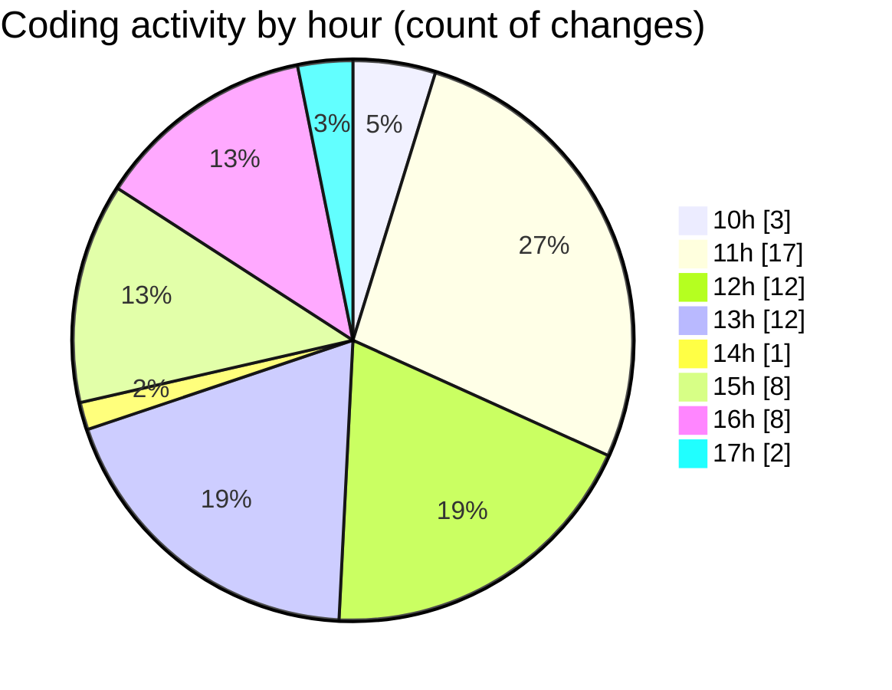

# nxtqube_webapp - Activity Summary 

## Overall Statistics

| Stat                   | Value                                                             |
| ---------------------- | ----------------------------------------------------------------- |
| **Lines Added** (➕)   | 4157                                          |
| **Lines Removed** (➖) | 140                                        |
| **Net Change** (↕)    | 4017                |
| **Active Time** (⌚)   | 66 minutes |

## Modified Files
- **pathMission.controller.js** (+449, -71)
- **ExistingMission.jsx** (+442, -0)
- **Map.jsx** (+900, -8)
- **useMissionDisplay.js** (+863, -27)
- **createGridMission.jsx** (+1503, -34)

## Visualizations

### By File Type (Lines Changed)

### By Hour (Estimated Activity Count)

> **Last Updated:** 19/09/2025, 17:09:58