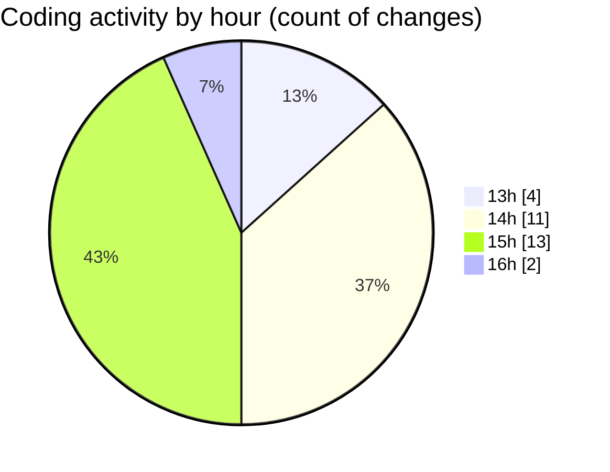

# nxtqube_webapp - Activity Summary 

## Overall Statistics

| Stat                   | Value                                                             |
| ---------------------- | ----------------------------------------------------------------- |
| **Lines Added** (➕)   | 3878                                          |
| **Lines Removed** (➖) | 41                                        |
| **Net Change** (↕)    | 3837                |
| **Active Time** (⌚)   | 44 minutes |

## Modified Files
- **createGridMission.jsx** (+1516, -7)
- **ExistingMission.jsx** (+493, -13)
- **useMissionDisplay.js** (+838, -0)
- **drawGrid.js** (+1031, -21)

## Visualizations

### By File Type (Lines Changed)

### By Hour (Estimated Activity Count)

> **Last Updated:** 21/09/2025, 16:18:02