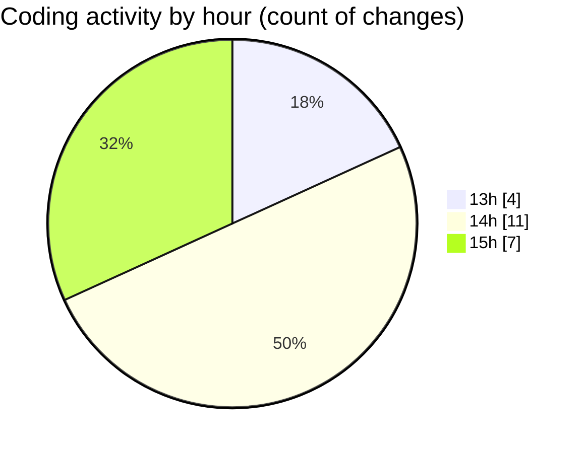

# nxtqube_webapp - Activity Summary 

## Overall Statistics

| Stat                   | Value                                                             |
| ---------------------- | ----------------------------------------------------------------- |
| **Lines Added** (➕)   | 3865                                          |
| **Lines Removed** (➖) | 14                                        |
| **Net Change** (↕)    | 3851                |
| **Active Time** (⌚)   | 30 minutes |

## Modified Files
- **createGridMission.jsx** (+1516, -7)
- **ExistingMission.jsx** (+483, -6)
- **useMissionDisplay.js** (+838, -0)
- **drawGrid.js** (+1028, -1)

## Visualizations

### By File Type (Lines Changed)

### By Hour (Estimated Activity Count)

> **Last Updated:** 21/09/2025, 15:36:03