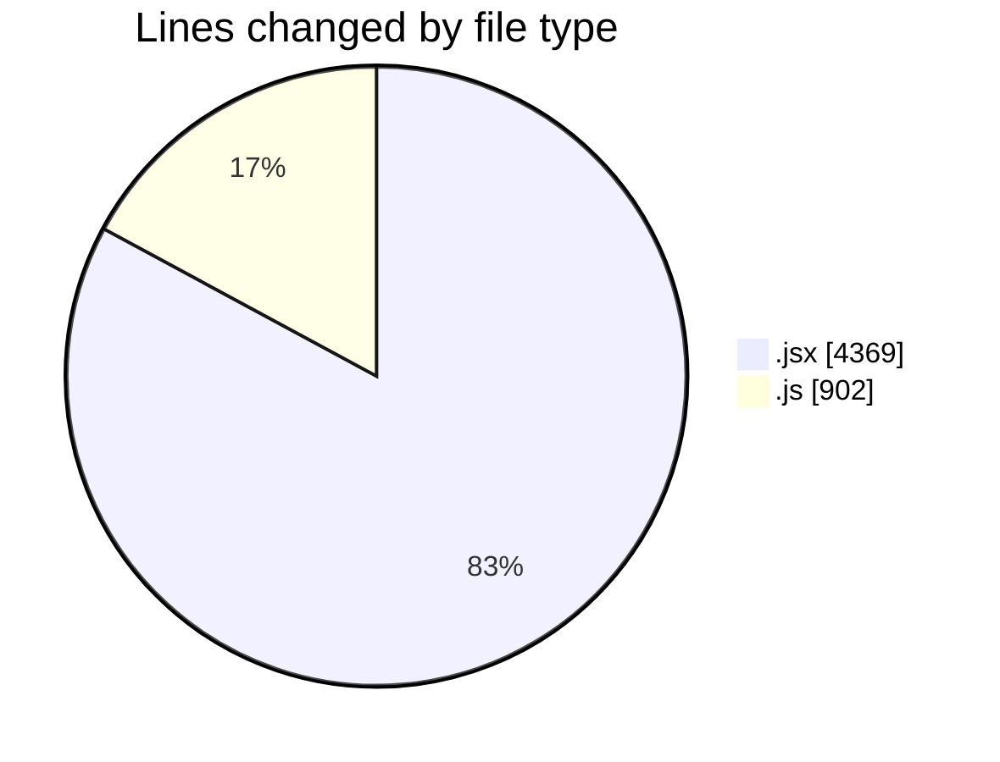
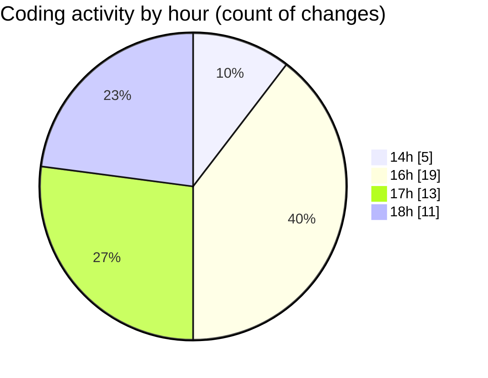

# nxtqube_webapp - Activity Summary 

## Overall Statistics

| Stat                   | Value                                                             |
| ---------------------- | ----------------------------------------------------------------- |
| **Lines Added** (➕)   | 4962                                          |
| **Lines Removed** (➖) | 309                                        |
| **Net Change** (↕)    | 4653                |
| **Active Time** (⌚)   | 72 minutes |

## Modified Files
- **createGridMission.jsx** (+1917, -277)
- **useMissionDisplay.js** (+870, -32)
- **Map.jsx** (+897, -0)
- **Mission.jsx** (+294, -0)
- **ManageMission.jsx** (+344, -0)
- **createMissionHome.jsx** (+640, -0)

## Visualizations

### By File Type (Lines Changed)

### By Hour (Estimated Activity Count)

> **Last Updated:** 22/09/2025, 18:06:18