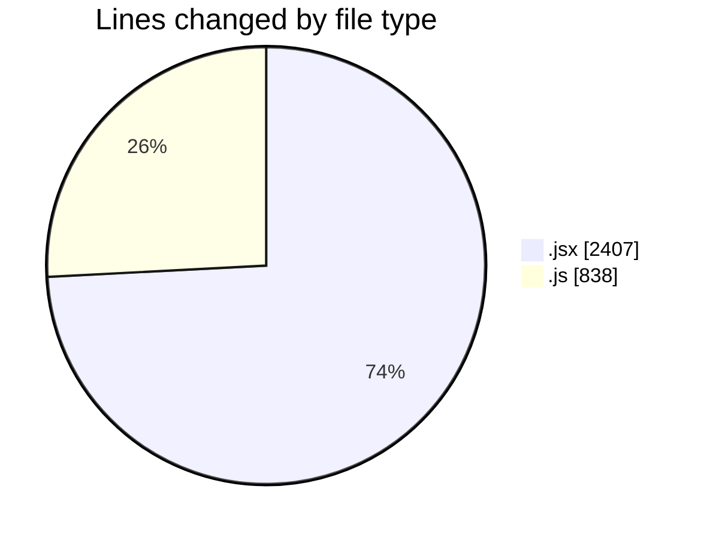
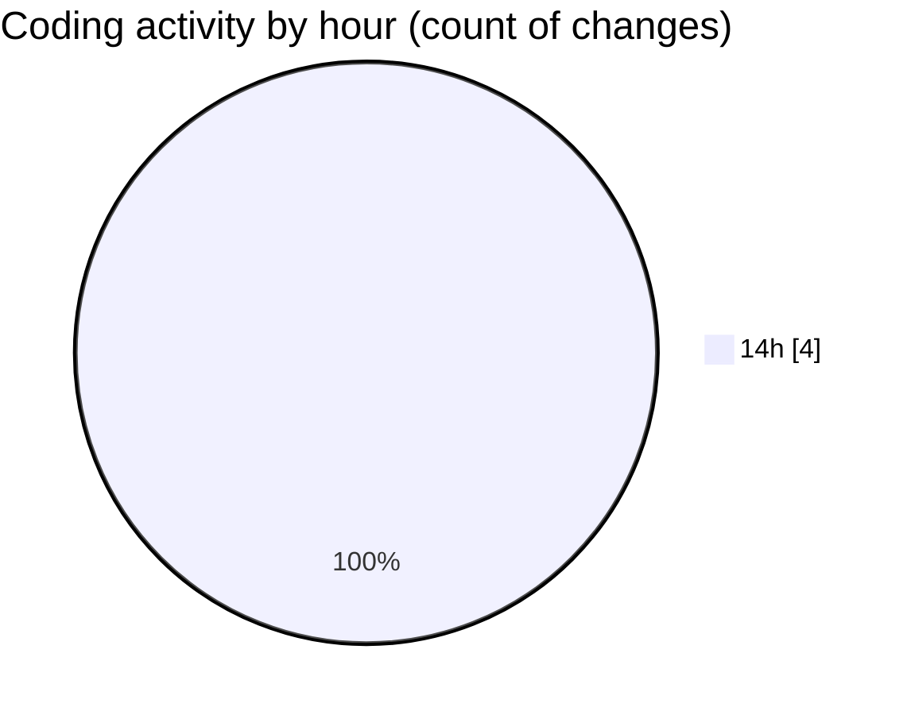

# nxtqube_webapp - Activity Summary 

## Overall Statistics

| Stat                   | Value                                                             |
| ---------------------- | ----------------------------------------------------------------- |
| **Lines Added** (➕)   | 3245                                          |
| **Lines Removed** (➖) | 0                                        |
| **Net Change** (↕)    | 3245                |
| **Active Time** (⌚)   | 6 minutes |

## Modified Files
- **createGridMission.jsx** (+1513, -0)
- **useMissionDisplay.js** (+838, -0)
- **Map.jsx** (+894, -0)

## Visualizations

### By File Type (Lines Changed)

### By Hour (Estimated Activity Count)

> **Last Updated:** 22/09/2025, 14:45:59