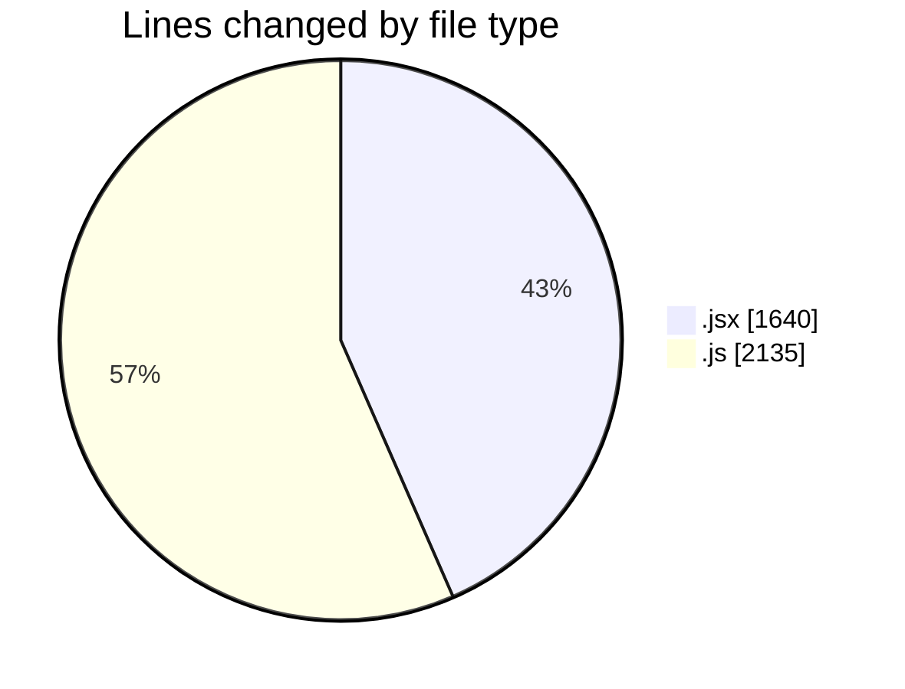
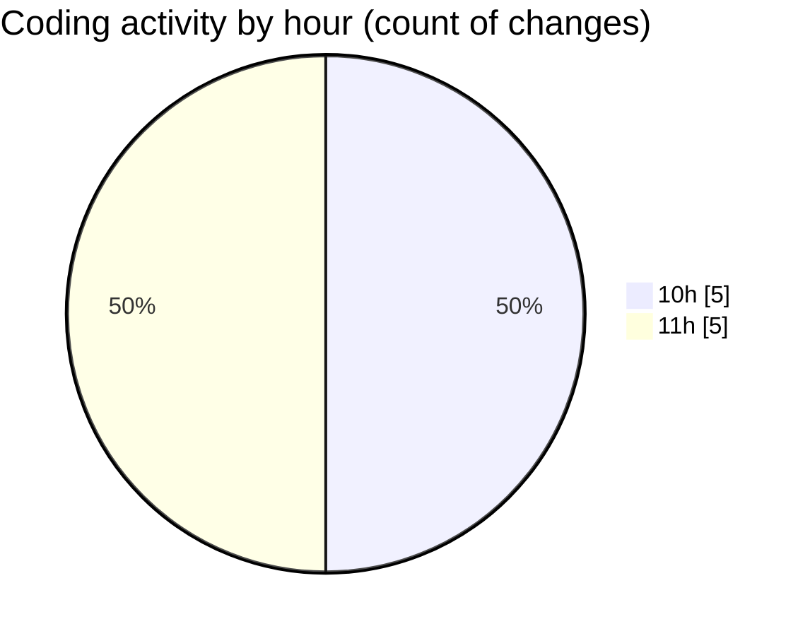

# nxtqube_webapp - Activity Summary 

## Overall Statistics

| Stat                   | Value                                                             |
| ---------------------- | ----------------------------------------------------------------- |
| **Lines Added** (➕)   | 3751                                          |
| **Lines Removed** (➖) | 24                                        |
| **Net Change** (↕)    | 3727                |
| **Active Time** (⌚)   | 11 minutes |

## Modified Files
- **createGridMission.jsx** (+1640, -0)
- **drawGrid.js** (+1216, -24)
- **useMissionDisplay.js** (+895, -0)

## Visualizations

### By File Type (Lines Changed)

### By Hour (Estimated Activity Count)

> **Last Updated:** 23/09/2025, 11:09:58