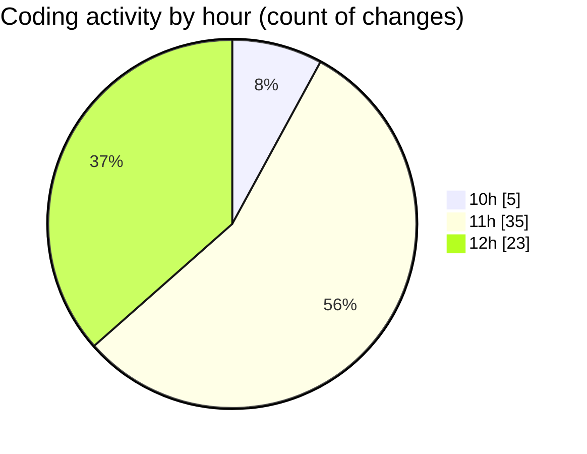

# nxtqube_webapp - Activity Summary 

## Overall Statistics

| Stat                   | Value                                                             |
| ---------------------- | ----------------------------------------------------------------- |
| **Lines Added** (➕)   | 6020                                          |
| **Lines Removed** (➖) | 1405                                        |
| **Net Change** (↕)    | 4615                |
| **Active Time** (⌚)   | 91 minutes |

## Modified Files
- **createGridMission.jsx** (+2781, -907)
- **drawGrid.js** (+1348, -342)
- **useMissionDisplay.js** (+994, -156)
- **Map.jsx** (+897, -0)

## Visualizations

### By File Type (Lines Changed)

### By Hour (Estimated Activity Count)

> **Last Updated:** 23/09/2025, 12:44:58