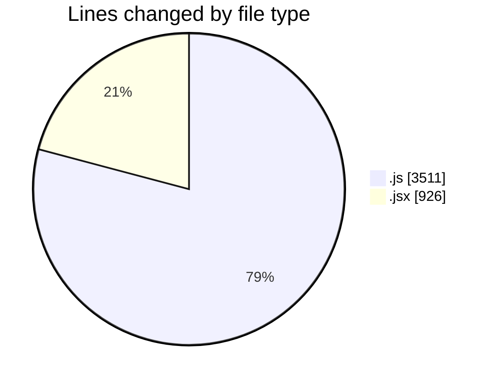
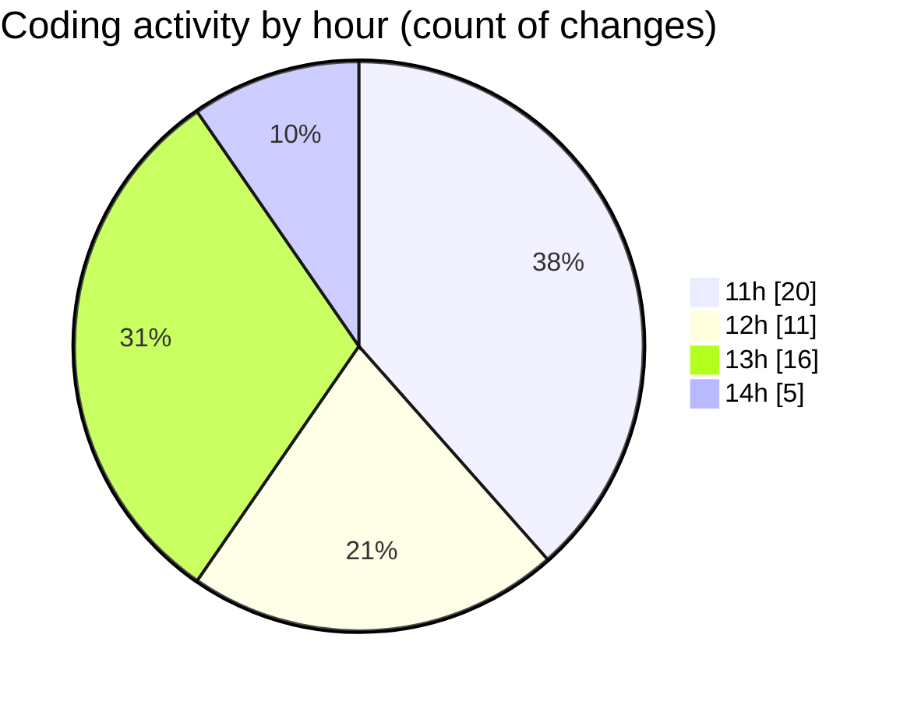

# nxtqube_webapp - Activity Summary 

## Overall Statistics

| Stat                   | Value                                                             |
| ---------------------- | ----------------------------------------------------------------- |
| **Lines Added** (➕)   | 2869                                          |
| **Lines Removed** (➖) | 1568                                        |
| **Net Change** (↕)    | 1301                |
| **Active Time** (⌚)   | 69 minutes |

## Modified Files
- **drawgridcopy.js** (+1625, -605)
- **drawGrid.js** (+331, -950)
- **Map.jsx** (+904, -7)
- **createGridMission.jsx** (+9, -6)

## Visualizations

### By File Type (Lines Changed)

### By Hour (Estimated Activity Count)

> **Last Updated:** 24/09/2025, 14:49:51