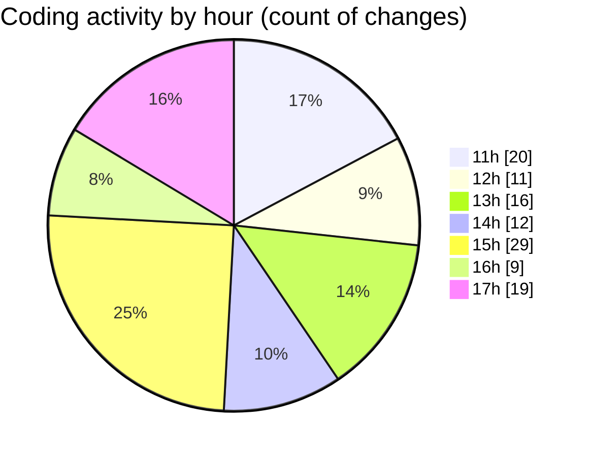

# nxtqube_webapp - Activity Summary 

## Overall Statistics

| Stat                   | Value                                                             |
| ---------------------- | ----------------------------------------------------------------- |
| **Lines Added** (➕)   | 8655                                          |
| **Lines Removed** (➖) | 5739                                        |
| **Net Change** (↕)    | 2916                |
| **Active Time** (⌚)   | 151 minutes |

## Modified Files
- **drawgridcopy.js** (+1625, -605)
- **drawGrid.js** (+2904, -2370)
- **Map.jsx** (+904, -7)
- **createGridMission.jsx** (+3222, -2757)

## Visualizations

### By File Type (Lines Changed)

### By Hour (Estimated Activity Count)

> **Last Updated:** 24/09/2025, 17:48:30