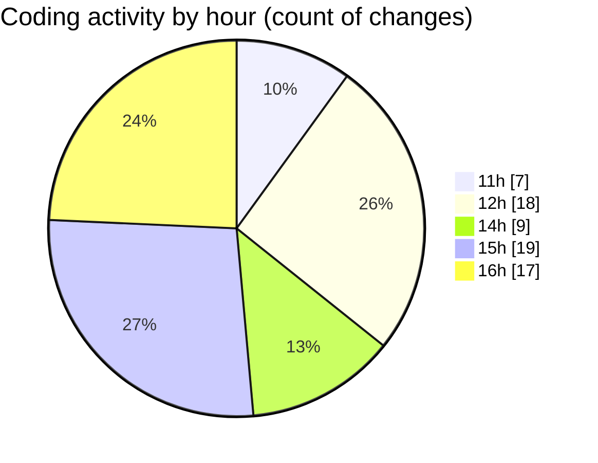

# nxtqube_webapp - Activity Summary 

## Overall Statistics

| Stat                   | Value                                                             |
| ---------------------- | ----------------------------------------------------------------- |
| **Lines Added** (➕)   | 11667                                          |
| **Lines Removed** (➖) | 7316                                        |
| **Net Change** (↕)    | 4351                |
| **Active Time** (⌚)   | 90 minutes |

## Modified Files
- **createGridMission.jsx** (+5460, -3541)
- **Sidenav.jsx** (+761, -13)
- **updateGridMission.js** (+605, -23)
- **createGridMission_cleaned.jsx** (+1961, -1960)
- **editMissionUtils.js** (+118, -0)
- **drawGrid.js** (+2762, -1779)

## Visualizations

### By File Type (Lines Changed)

### By Hour (Estimated Activity Count)

> **Last Updated:** 25/09/2025, 17:04:13