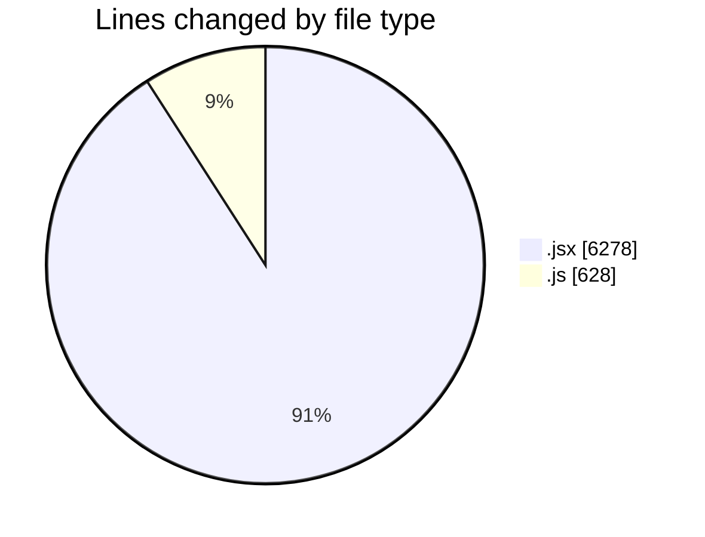
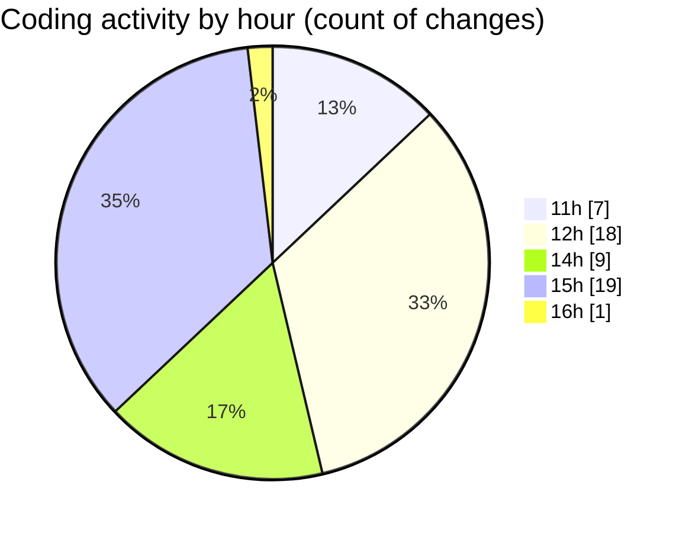

# nxtqube_webapp - Activity Summary 

## Overall Statistics

| Stat                   | Value                                                             |
| ---------------------- | ----------------------------------------------------------------- |
| **Lines Added** (➕)   | 5331                                          |
| **Lines Removed** (➖) | 1575                                        |
| **Net Change** (↕)    | 3756                |
| **Active Time** (⌚)   | 66 minutes |

## Modified Files
- **createGridMission.jsx** (+3502, -1539)
- **Sidenav.jsx** (+761, -13)
- **updateGridMission.js** (+605, -23)
- **createGridMission_cleaned.jsx** (+463, -0)

## Visualizations

### By File Type (Lines Changed)

### By Hour (Estimated Activity Count)

> **Last Updated:** 25/09/2025, 16:09:13