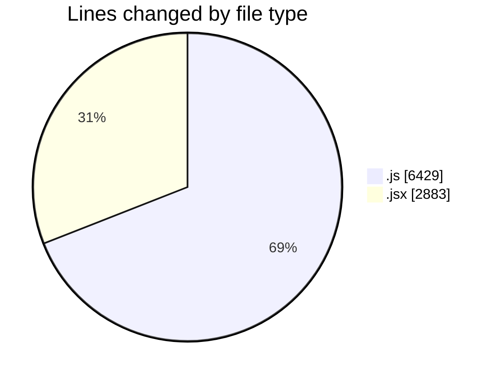
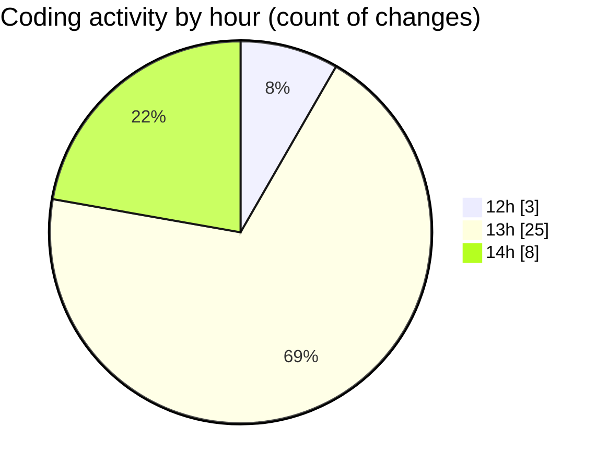

# nxtqube_webapp - Activity Summary 

## Overall Statistics

| Stat                   | Value                                                             |
| ---------------------- | ----------------------------------------------------------------- |
| **Lines Added** (➕)   | 8148                                          |
| **Lines Removed** (➖) | 1164                                        |
| **Net Change** (↕)    | 6984                |
| **Active Time** (⌚)   | 61 minutes |

## Modified Files
- **editMissionUtils.js** (+198, -0)
- **drawGrid.js** (+5109, -1122)
- **Map.jsx** (+932, -21)
- **createGridMission.jsx** (+1909, -21)

## Visualizations

### By File Type (Lines Changed)

### By Hour (Estimated Activity Count)

> **Last Updated:** 26/09/2025, 14:50:39