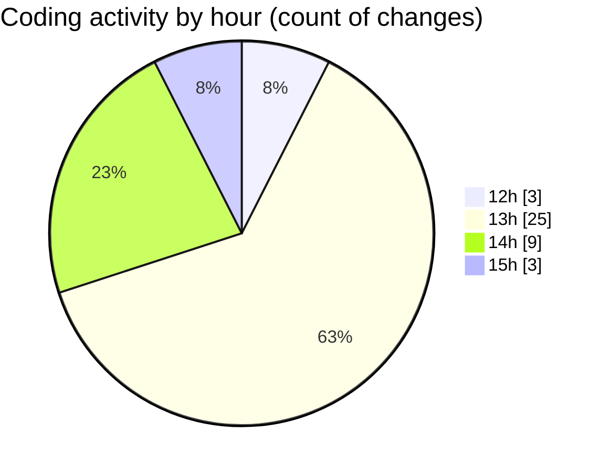

# nxtqube_webapp - Activity Summary 

## Overall Statistics

| Stat                   | Value                                                             |
| ---------------------- | ----------------------------------------------------------------- |
| **Lines Added** (➕)   | 8334                                          |
| **Lines Removed** (➖) | 1196                                        |
| **Net Change** (↕)    | 7138                |
| **Active Time** (⌚)   | 63 minutes |

## Modified Files
- **editMissionUtils.js** (+198, -0)
- **drawGrid.js** (+5134, -1122)
- **Map.jsx** (+932, -22)
- **createGridMission.jsx** (+1909, -21)
- **gridMissionUtils.js** (+161, -31)

## Visualizations

### By File Type (Lines Changed)

### By Hour (Estimated Activity Count)

> **Last Updated:** 26/09/2025, 15:20:39