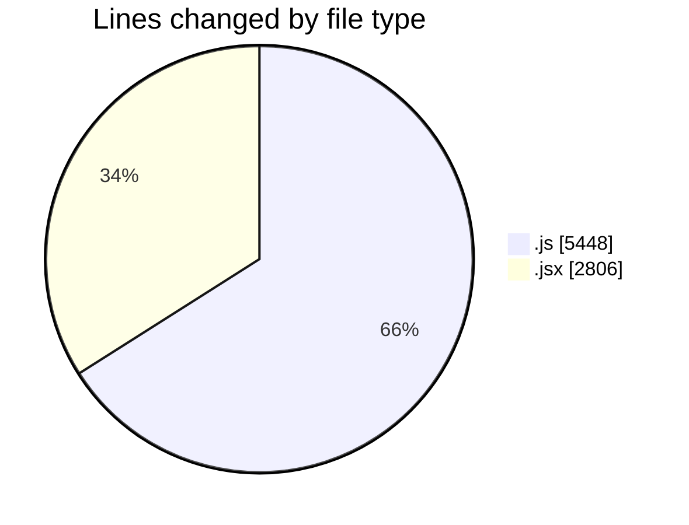
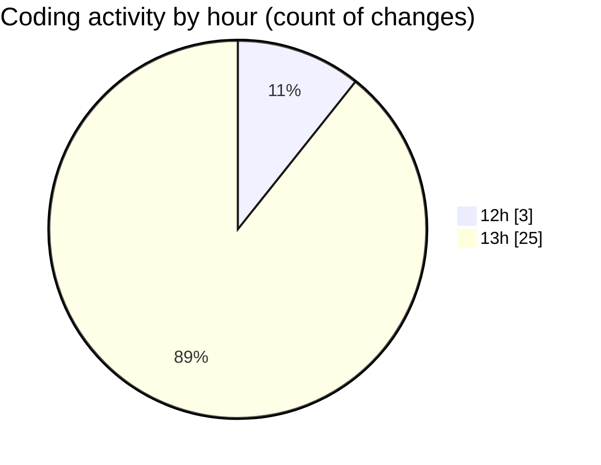

# nxtqube_webapp - Activity Summary 

## Overall Statistics

| Stat                   | Value                                                             |
| ---------------------- | ----------------------------------------------------------------- |
| **Lines Added** (➕)   | 7132                                          |
| **Lines Removed** (➖) | 1122                                        |
| **Net Change** (↕)    | 6010                |
| **Active Time** (⌚)   | 49 minutes |

## Modified Files
- **editMissionUtils.js** (+198, -0)
- **drawGrid.js** (+4128, -1122)
- **Map.jsx** (+906, -0)
- **createGridMission.jsx** (+1900, -0)

## Visualizations

### By File Type (Lines Changed)

### By Hour (Estimated Activity Count)

> **Last Updated:** 26/09/2025, 14:05:07