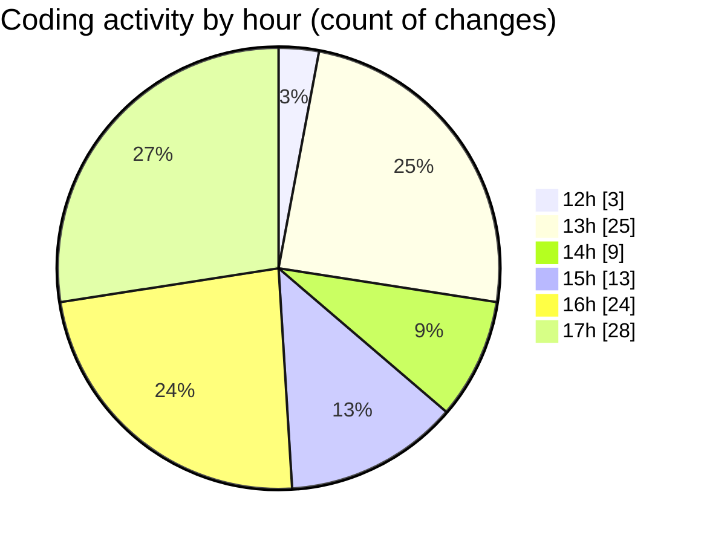

# nxtqube_webapp - Activity Summary 

## Overall Statistics

| Stat                   | Value                                                             |
| ---------------------- | ----------------------------------------------------------------- |
| **Lines Added** (➕)   | 14182                                          |
| **Lines Removed** (➖) | 5292                                        |
| **Net Change** (↕)    | 8890                |
| **Active Time** (⌚)   | 132 minutes |

## Modified Files
- **editMissionUtils.js** (+397, -1)
- **drawGrid.js** (+8098, -5164)
- **Map.jsx** (+932, -22)
- **createGridMission.jsx** (+1942, -51)
- **gridMissionUtils.js** (+161, -31)
- **gridcalculations.js** (+966, -23)
- **updateGridMission.js** (+1240, -0)
- **gridCalculations.js** (+446, -0)

## Visualizations

### By File Type (Lines Changed)

### By Hour (Estimated Activity Count)

> **Last Updated:** 26/09/2025, 17:31:18