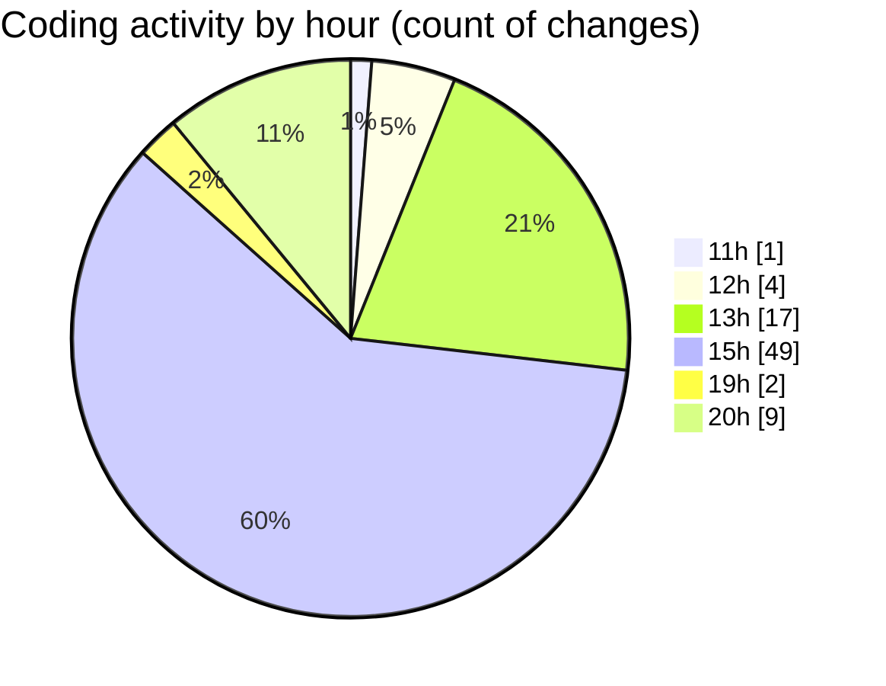

# nxtqube_webapp - Activity Summary 

## Overall Statistics

| Stat                   | Value                                                             |
| ---------------------- | ----------------------------------------------------------------- |
| **Lines Added** (➕)   | 6464                                          |
| **Lines Removed** (➖) | 1690                                        |
| **Net Change** (↕)    | 4774                |
| **Active Time** (⌚)   | 103 minutes |

## Modified Files
- **createGridMission.jsx** (+3664, -1087)
- **Map.jsx** (+911, -0)
- **updateGridMission.js** (+1492, -603)
- **editMissionUtils.js** (+397, -0)

## Visualizations

### By File Type (Lines Changed)

### By Hour (Estimated Activity Count)

> **Last Updated:** 28/09/2025, 20:21:33