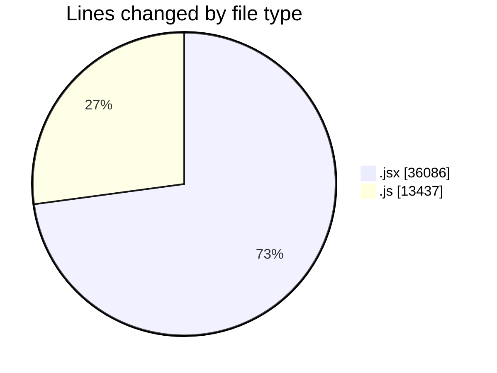
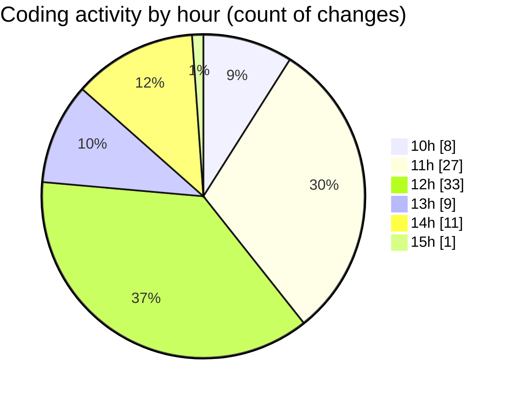

# nxtqube_webapp - Activity Summary 

## Overall Statistics

| Stat                   | Value                                                             |
| ---------------------- | ----------------------------------------------------------------- |
| **Lines Added** (➕)   | 27760                                          |
| **Lines Removed** (➖) | 21763                                        |
| **Net Change** (↕)    | 5997                |
| **Active Time** (⌚)   | 130 minutes |

## Modified Files
- **createGridMission.jsx** (+19182, -16904)
- **updateGridMission.js** (+7528, -4859)
- **drawGrid.js** (+1050, -0)

## Visualizations

### By File Type (Lines Changed)

### By Hour (Estimated Activity Count)

> **Last Updated:** 29/09/2025, 15:03:13