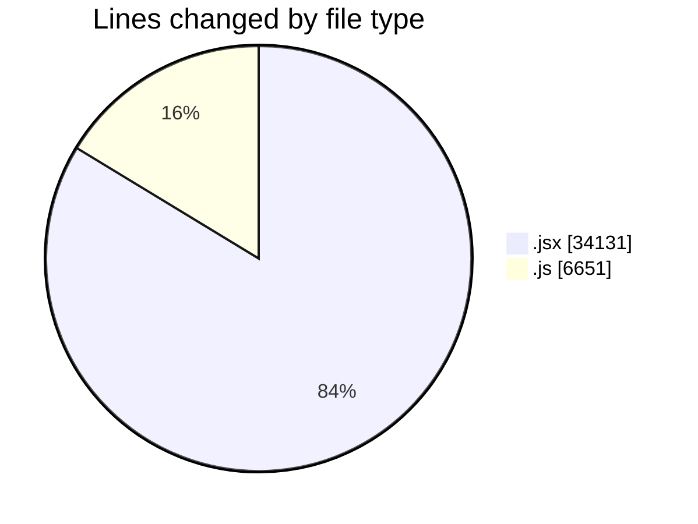
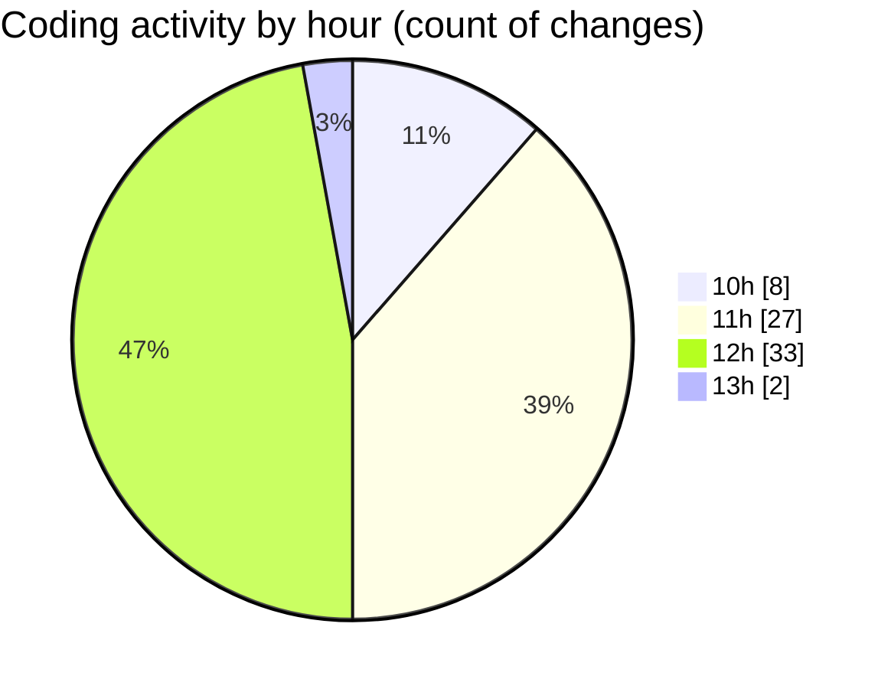

# nxtqube_webapp - Activity Summary 

## Overall Statistics

| Stat                   | Value                                                             |
| ---------------------- | ----------------------------------------------------------------- |
| **Lines Added** (➕)   | 22642                                          |
| **Lines Removed** (➖) | 18140                                        |
| **Net Change** (↕)    | 4502                |
| **Active Time** (⌚)   | 103 minutes |

## Modified Files
- **createGridMission.jsx** (+18202, -15929)
- **updateGridMission.js** (+3390, -2211)
- **drawGrid.js** (+1050, -0)

## Visualizations

### By File Type (Lines Changed)

### By Hour (Estimated Activity Count)

> **Last Updated:** 29/09/2025, 13:00:43