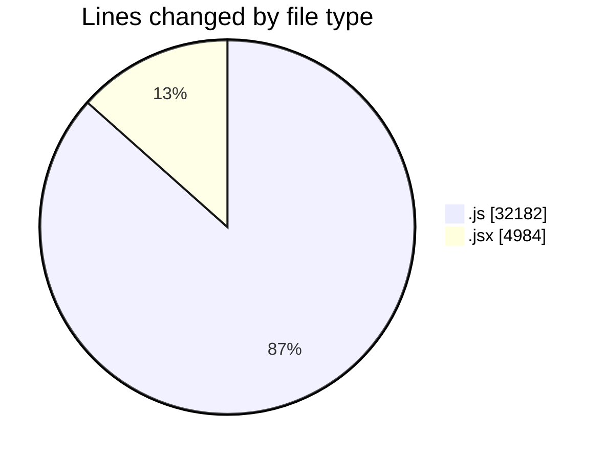
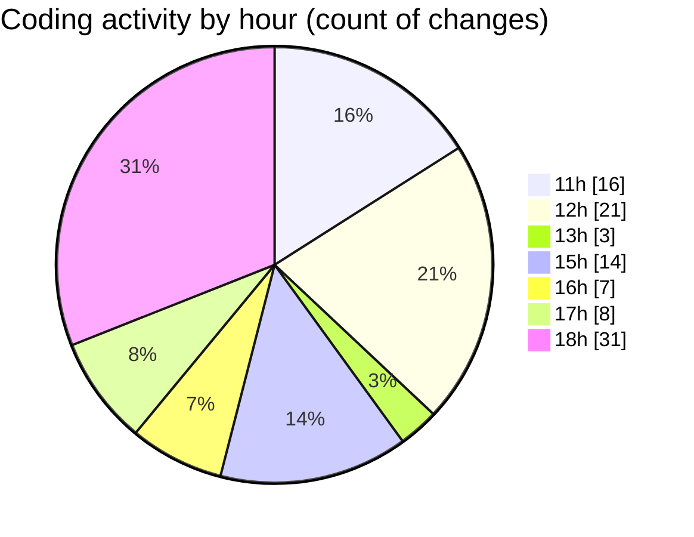

# nxtqube_webapp - Activity Summary 

## Overall Statistics

| Stat                   | Value                                                             |
| ---------------------- | ----------------------------------------------------------------- |
| **Lines Added** (➕)   | 21145                                          |
| **Lines Removed** (➖) | 16021                                        |
| **Net Change** (↕)    | 5124                |
| **Active Time** (⌚)   | 130 minutes |

## Modified Files
- **updateGridMission.js** (+11517, -10880)
- **editMissionUtils.js** (+530, -332)
- **drawGrid.js** (+1547, -622)
- **createGridMission.jsx** (+3479, -1505)
- **editGridManager.js** (+672, -86)
- **gridMissionUtils.js** (+3400, -2596)

## Visualizations

### By File Type (Lines Changed)

### By Hour (Estimated Activity Count)

> **Last Updated:** 30/09/2025, 18:50:58