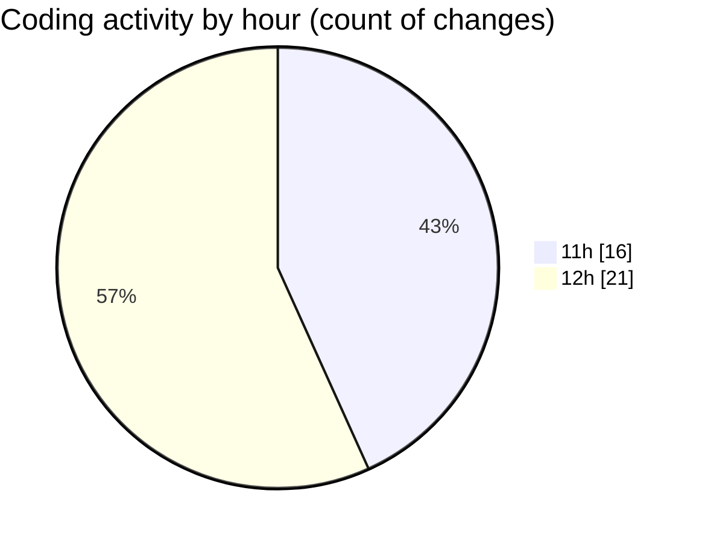

# nxtqube_webapp - Activity Summary 

## Overall Statistics

| Stat                   | Value                                                             |
| ---------------------- | ----------------------------------------------------------------- |
| **Lines Added** (➕)   | 14446                                          |
| **Lines Removed** (➖) | 10059                                        |
| **Net Change** (↕)    | 4387                |
| **Active Time** (⌚)   | 51 minutes |

## Modified Files
- **updateGridMission.js** (+10497, -9767)
- **editMissionUtils.js** (+364, -0)
- **drawGrid.js** (+1174, -249)
- **createGridMission.jsx** (+2411, -43)

## Visualizations

### By File Type (Lines Changed)

### By Hour (Estimated Activity Count)

> **Last Updated:** 30/09/2025, 12:56:03