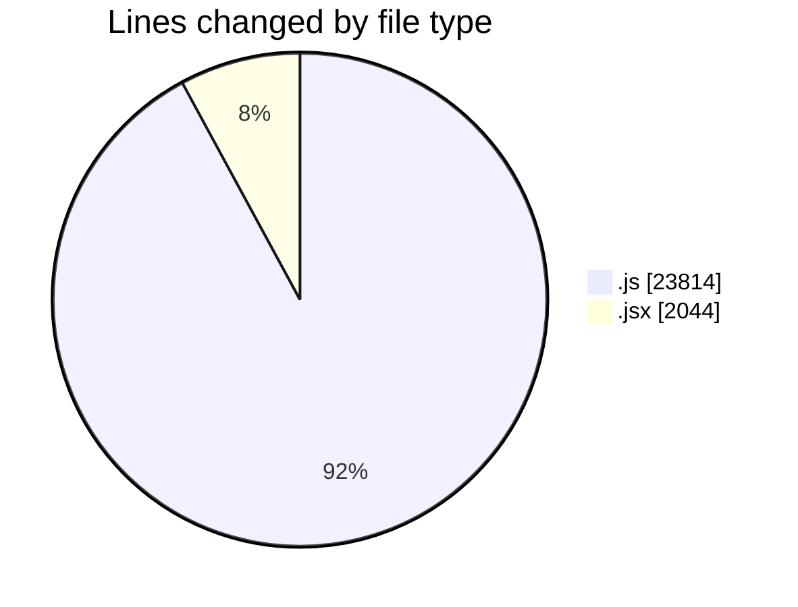
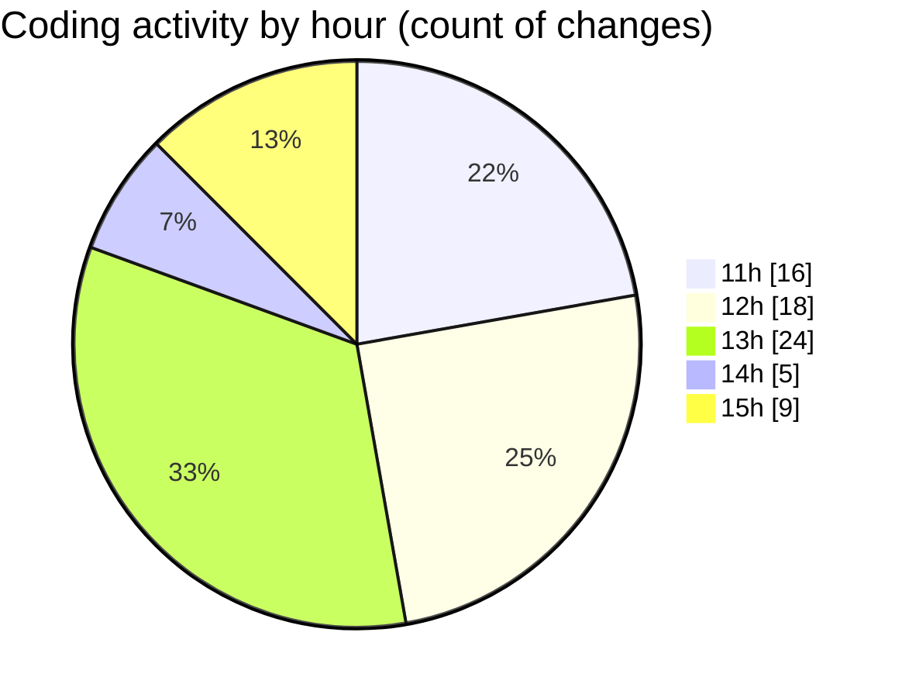

# nxtqube_webapp - Activity Summary 

## Overall Statistics

| Stat                   | Value                                                             |
| ---------------------- | ----------------------------------------------------------------- |
| **Lines Added** (➕)   | 15070                                          |
| **Lines Removed** (➖) | 10788                                        |
| **Net Change** (↕)    | 4282                |
| **Active Time** (⌚)   | 115 minutes |

## Modified Files
- **gridMissionUtils.js** (+10825, -9776)
- **drawGrid.js** (+1794, -938)
- **createGridMission.jsx** (+2044, -0)
- **dataProcessor.js** (+407, -74)

## Visualizations

### By File Type (Lines Changed)

### By Hour (Estimated Activity Count)

> **Last Updated:** 01/10/2025, 15:21:44