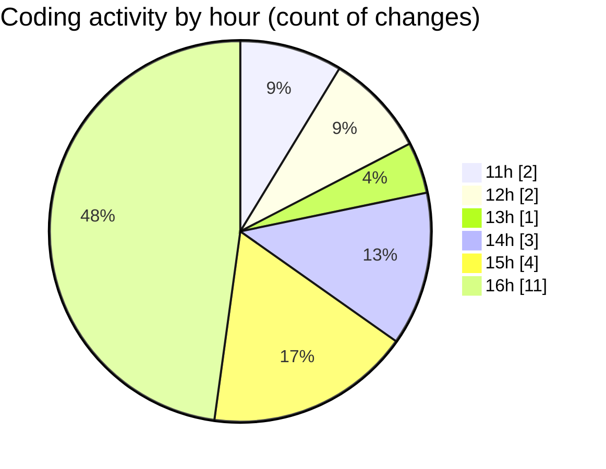

# nxtqube_webapp - Activity Summary 

## Overall Statistics

| Stat                   | Value                                                             |
| ---------------------- | ----------------------------------------------------------------- |
| **Lines Added** (➕)   | 3197                                          |
| **Lines Removed** (➖) | 469                                        |
| **Net Change** (↕)    | 2728                |
| **Active Time** (⌚)   | 17 minutes |

## Modified Files
- **draw3D.js** (+792, -409)
- **create3DMission.jsx** (+966, -57)
- **Map.jsx** (+995, -0)
- **RouteSettingsPanel.jsx** (+421, -0)
- **Mission3DContext.jsx** (+23, -3)

## Visualizations

### By File Type (Lines Changed)

### By Hour (Estimated Activity Count)

> **Last Updated:** 10/10/2025, 16:44:57