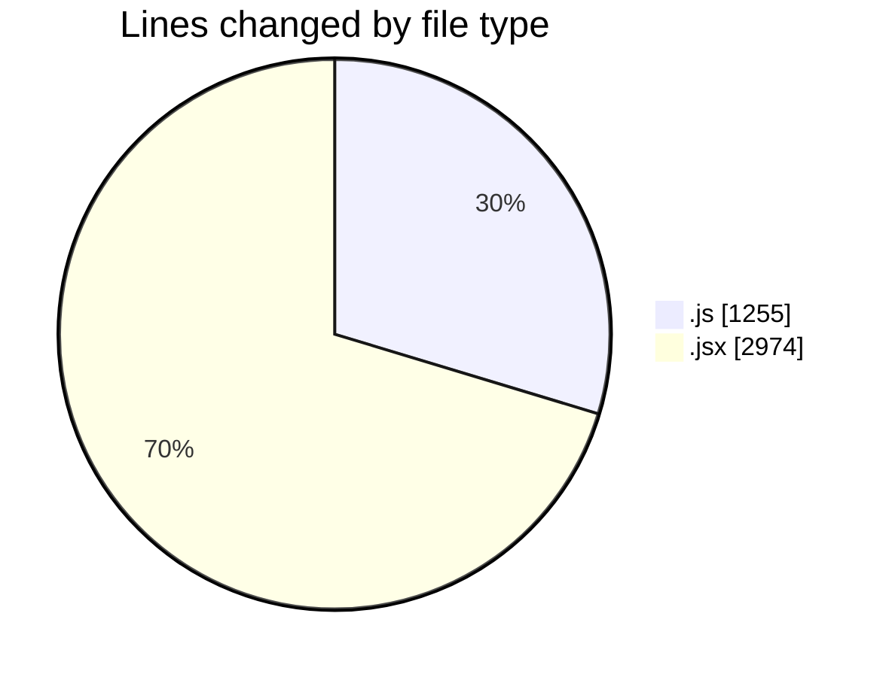
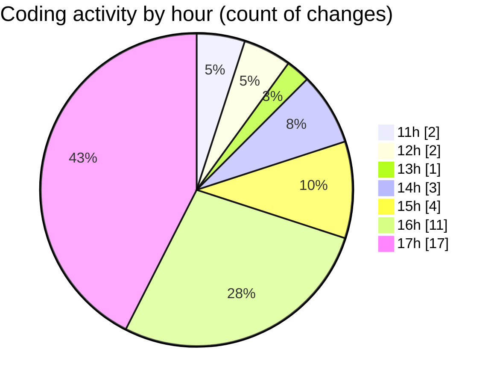

# nxtqube_webapp - Activity Summary 

## Overall Statistics

| Stat                   | Value                                                             |
| ---------------------- | ----------------------------------------------------------------- |
| **Lines Added** (➕)   | 3609                                          |
| **Lines Removed** (➖) | 620                                        |
| **Net Change** (↕)    | 2989                |
| **Active Time** (⌚)   | 47 minutes |

## Modified Files
- **draw3D.js** (+819, -436)
- **create3DMission.jsx** (+1027, -118)
- **Map.jsx** (+1009, -14)
- **RouteSettingsPanel.jsx** (+421, -0)
- **Mission3DContext.jsx** (+23, -3)
- **App.jsx** (+57, -3)
- **SearchBox.jsx** (+253, -46)

## Visualizations

### By File Type (Lines Changed)

### By Hour (Estimated Activity Count)

> **Last Updated:** 10/10/2025, 17:50:03