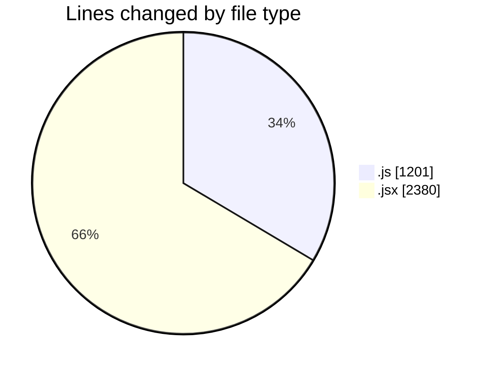
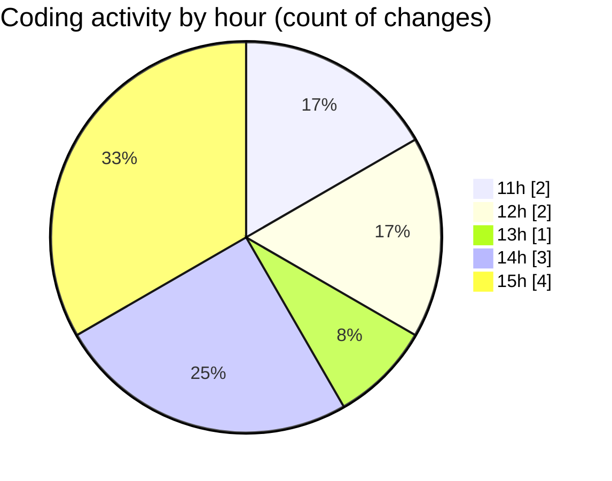

# nxtqube_webapp - Activity Summary 

## Overall Statistics

| Stat                   | Value                                                             |
| ---------------------- | ----------------------------------------------------------------- |
| **Lines Added** (➕)   | 3171                                          |
| **Lines Removed** (➖) | 410                                        |
| **Net Change** (↕)    | 2761                |
| **Active Time** (⌚)   | 6 minutes |

## Modified Files
- **draw3D.js** (+792, -409)
- **create3DMission.jsx** (+963, -1)
- **Map.jsx** (+995, -0)
- **RouteSettingsPanel.jsx** (+421, -0)

## Visualizations

### By File Type (Lines Changed)

### By Hour (Estimated Activity Count)

> **Last Updated:** 10/10/2025, 15:32:45