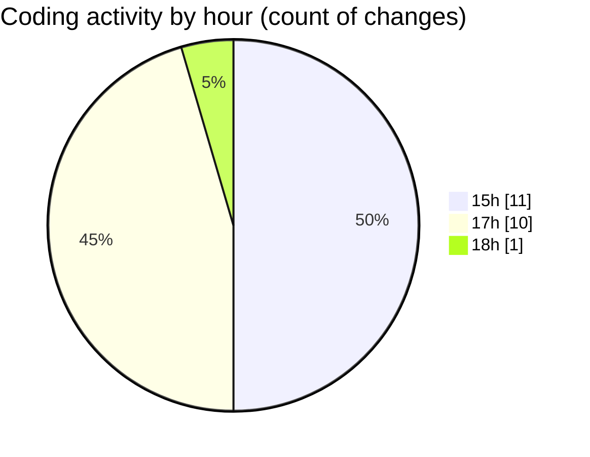

# nxtqube_webapp - Activity Summary 

## Overall Statistics

| Stat                   | Value                                                             |
| ---------------------- | ----------------------------------------------------------------- |
| **Lines Added** (➕)   | 2297                                          |
| **Lines Removed** (➖) | 86                                        |
| **Net Change** (↕)    | 2211                |
| **Active Time** (⌚)   | 28 minutes |

## Modified Files
- **create3DMission.jsx** (+913, -62)
- **Map.jsx** (+1001, -20)
- **draw3D.js** (+383, -4)

## Visualizations

### By File Type (Lines Changed)

### By Hour (Estimated Activity Count)

> **Last Updated:** 13/10/2025, 18:25:18