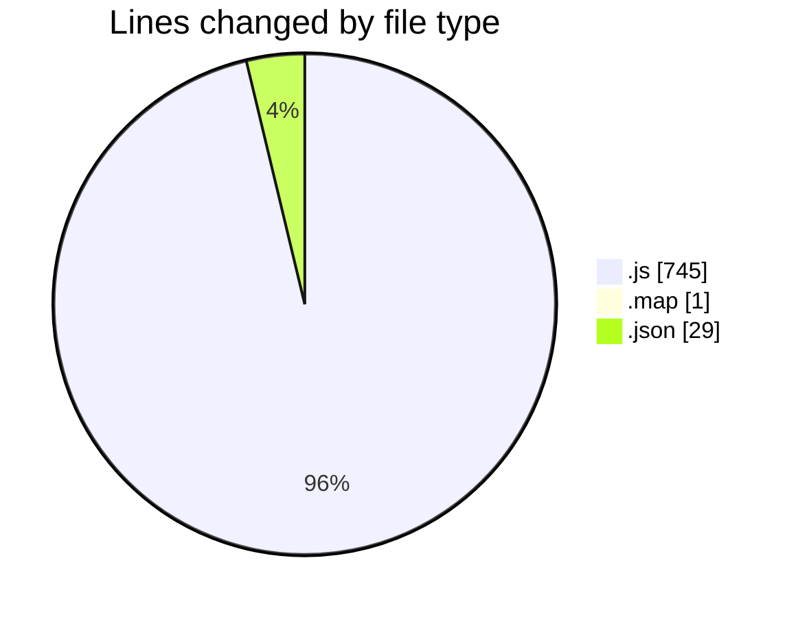
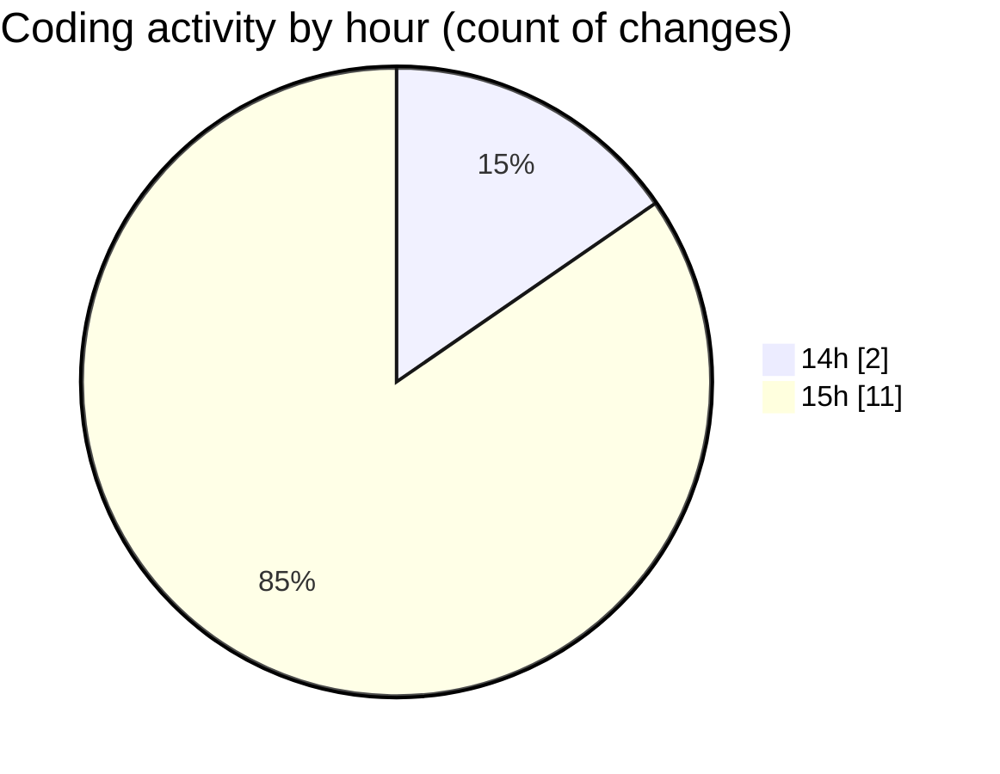

# accounting-master - Activity Summary 

## Overall Statistics

| Stat                   | Value                                                             |
| ---------------------- | ----------------------------------------------------------------- |
| **Lines Added** (➕)   | 775                                          |
| **Lines Removed** (➖) | 0                                        |
| **Net Change** (↕)    | 775                |
| **Active Time** (⌚)   | 6 minutes |

## Modified Files
- **Footer.js** (+28, -0)
- **App.js** (+54, -0)
- **index.js** (+21, -0)
- **main.1c151edd.chunk.js** (+2, -0)
- **main.1c151edd.chunk.js.map** (+1, -0)
- **package.json** (+29, -0)
- **index.js** (+116, -0)
- **invoices.js** (+101, -0)
- **store.js** (+36, -0)
- **invoice.js** (+203, -0)
- **Home.js** (+24, -0)
- **email.js** (+160, -0)

## Visualizations

### By File Type (Lines Changed)

### By Hour (Estimated Activity Count)

> **Last Updated:** 14/10/2025, 15:19:39