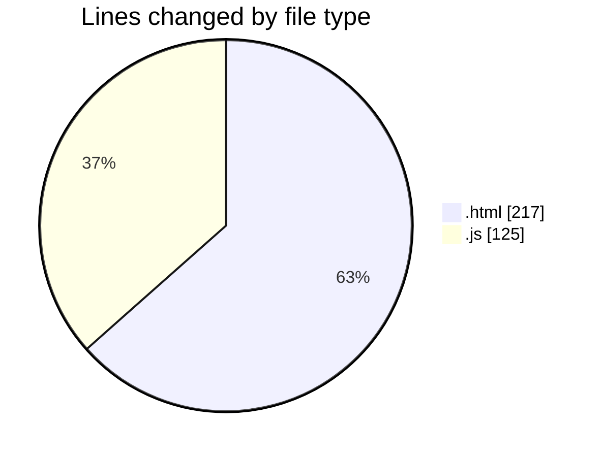
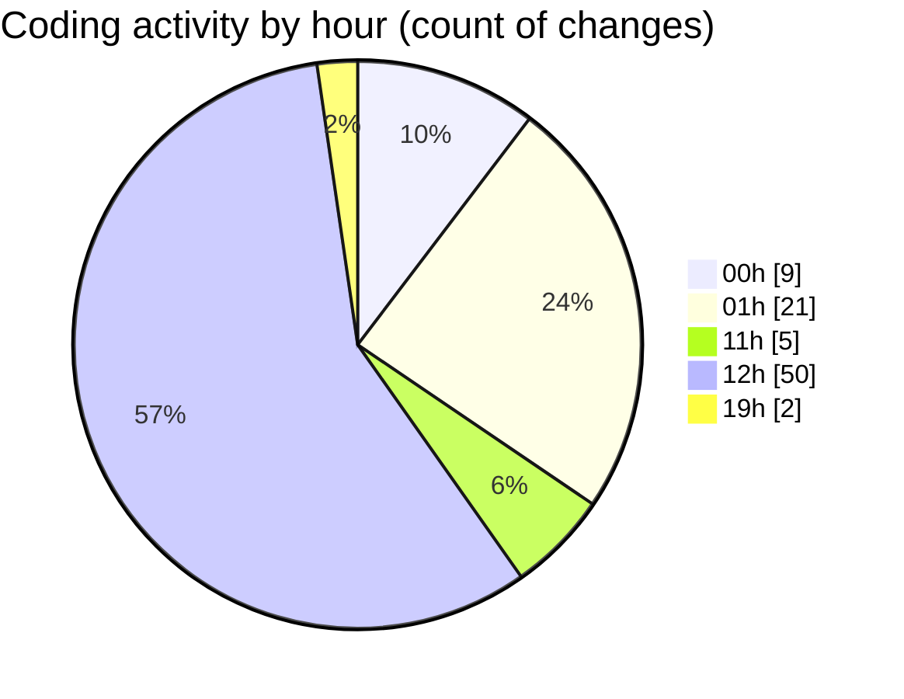

# javacript - Activity Summary 

## Overall Statistics

| Stat                   | Value                                                             |
| ---------------------- | ----------------------------------------------------------------- |
| **Lines Added** (➕)   | 225                                          |
| **Lines Removed** (➖) | 117                                        |
| **Net Change** (↕)    | 108                |
| **Active Time** (⌚)   | 100 minutes |

## Modified Files
- **index.html** (+86, -43)
- **index.html** (+50, -38)
- **ArrayReverse.js** (+89, -36)

## Visualizations

### By File Type (Lines Changed)

### By Hour (Estimated Activity Count)

> **Last Updated:** 25/10/2025, 19:41:44