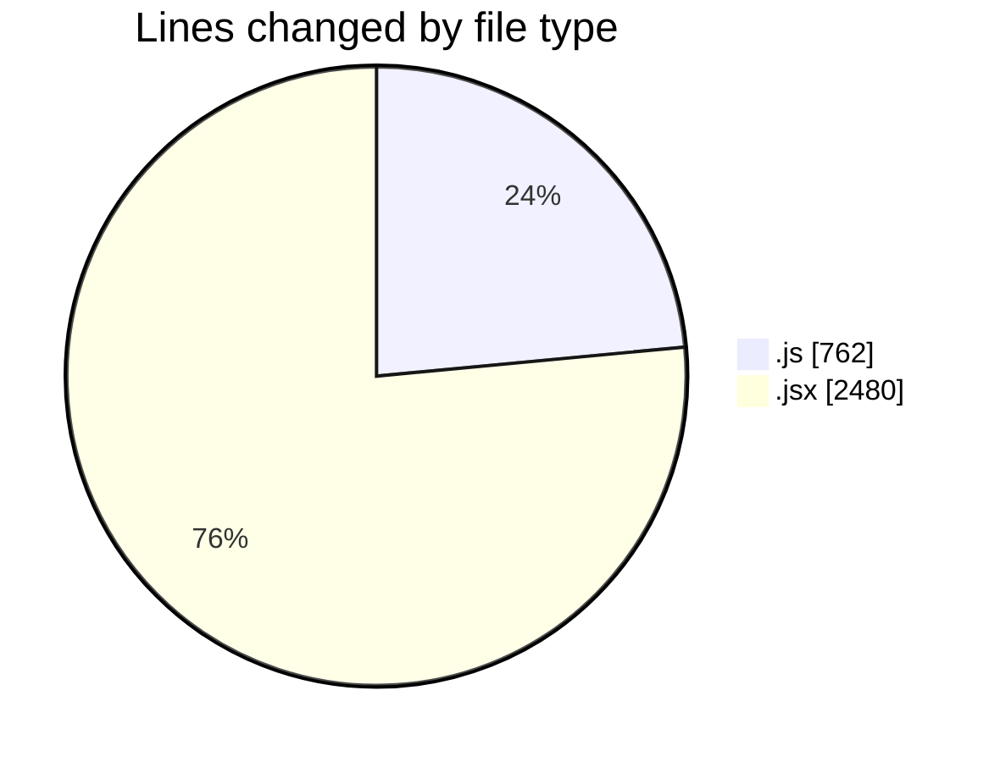
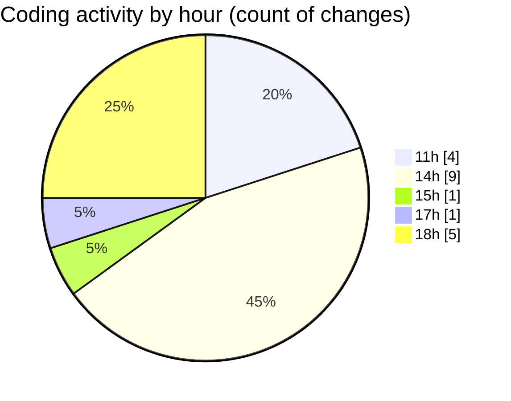

# nxtqube_webapp - Activity Summary 

## Overall Statistics

| Stat                   | Value                                                             |
| ---------------------- | ----------------------------------------------------------------- |
| **Lines Added** (➕)   | 3230                                          |
| **Lines Removed** (➖) | 12                                        |
| **Net Change** (↕)    | 3218                |
| **Active Time** (⌚)   | 20 minutes |

## Modified Files
- **draw3D.js** (+757, -5)
- **RouteSettingsPanel.jsx** (+421, -0)
- **create3DMission.jsx** (+854, -7)
- **Map.jsx** (+1198, -0)

## Visualizations

### By File Type (Lines Changed)

### By Hour (Estimated Activity Count)

> **Last Updated:** 26/10/2025, 18:49:52