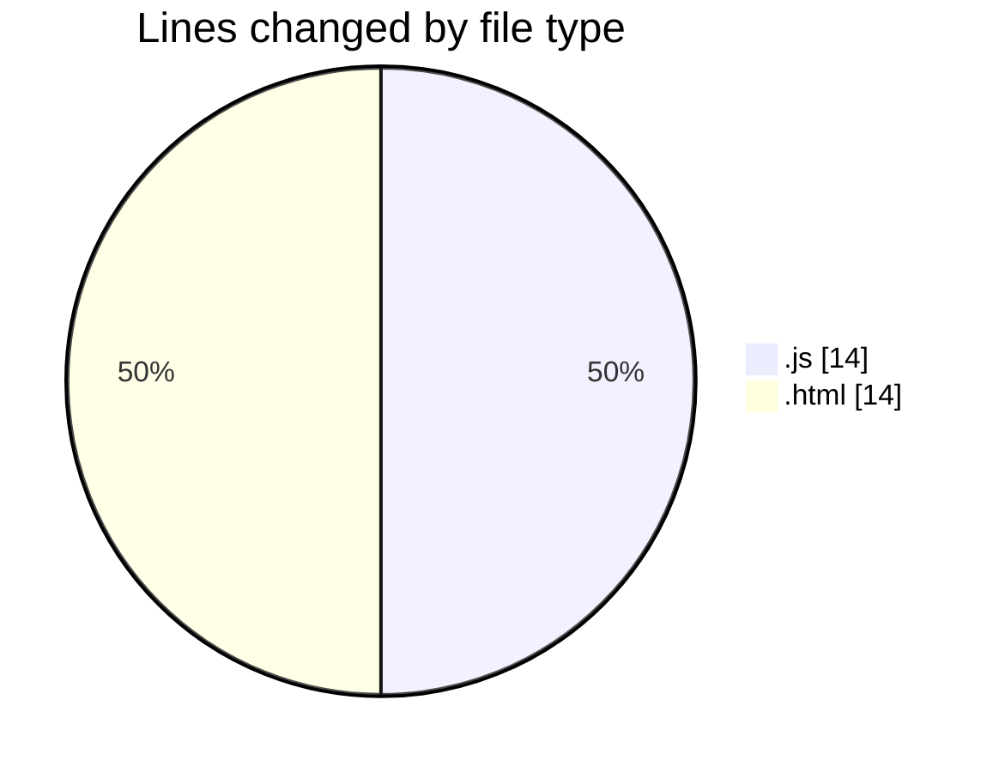
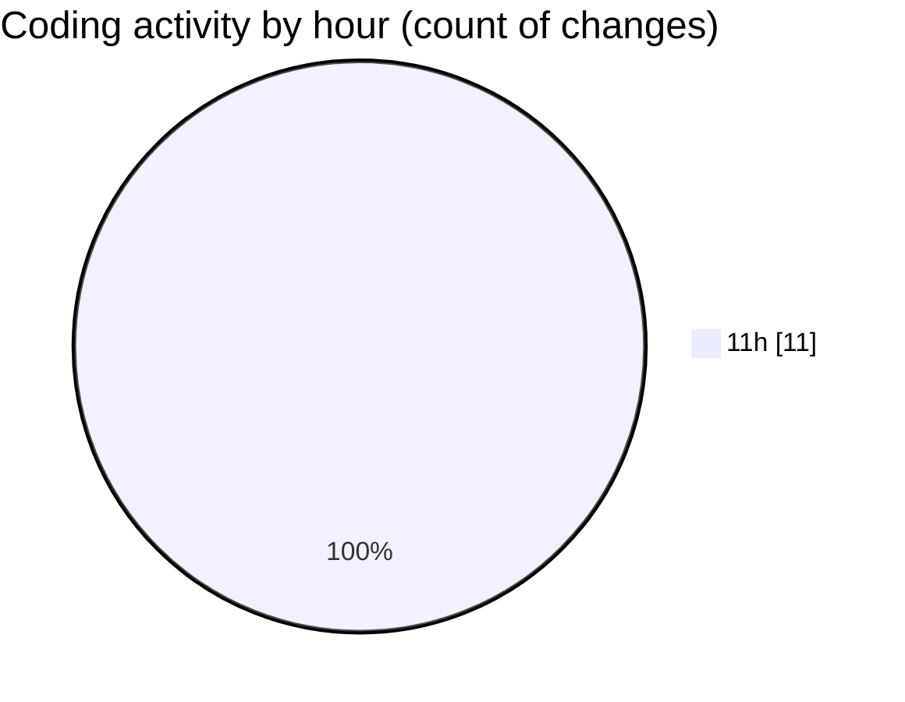

# javacript - Activity Summary 

## Overall Statistics

| Stat                   | Value                                                             |
| ---------------------- | ----------------------------------------------------------------- |
| **Lines Added** (➕)   | 25                                          |
| **Lines Removed** (➖) | 3                                        |
| **Net Change** (↕)    | 22                |
| **Active Time** (⌚)   | 12 minutes |

## Modified Files
- **MaxMinArray.js** (+11, -3)
- **index.html** (+14, -0)

## Visualizations

### By File Type (Lines Changed)

### By Hour (Estimated Activity Count)

> **Last Updated:** 28/10/2025, 11:42:34