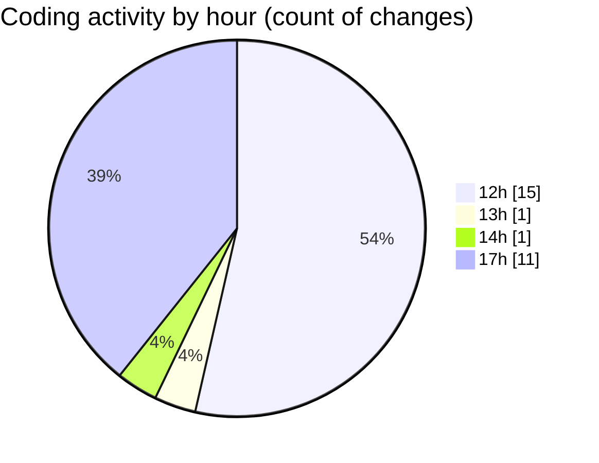

# nxtqube_webapp - Activity Summary 

## Overall Statistics

| Stat                   | Value                                                             |
| ---------------------- | ----------------------------------------------------------------- |
| **Lines Added** (➕)   | 3171                                          |
| **Lines Removed** (➖) | 41                                        |
| **Net Change** (↕)    | 3130                |
| **Active Time** (⌚)   | 39 minutes |

## Modified Files
- **draw3D.js** (+801, -30)
- **create3DMission.jsx** (+1073, -5)
- **Map.jsx** (+1268, -6)
- **Mission3DContext.jsx** (+29, -0)

## Visualizations

### By File Type (Lines Changed)

### By Hour (Estimated Activity Count)

> **Last Updated:** 29/10/2025, 17:24:24