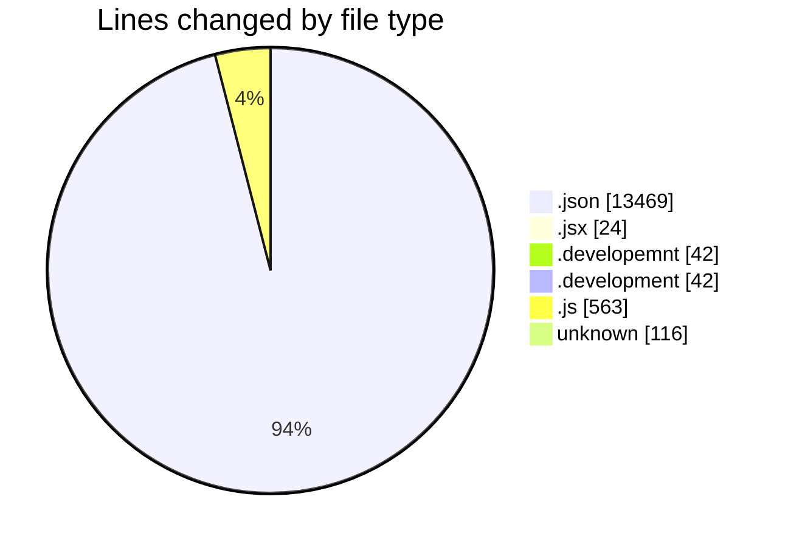
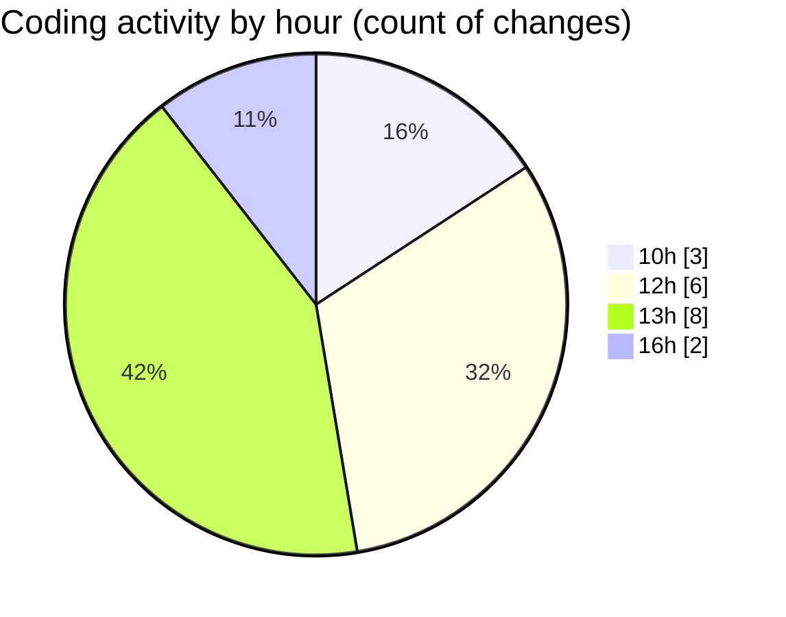

# nxtqube_webapp - Activity Summary 

## Overall Statistics

| Stat                   | Value                                                             |
| ---------------------- | ----------------------------------------------------------------- |
| **Lines Added** (➕)   | 14198                                          |
| **Lines Removed** (➖) | 58                                        |
| **Net Change** (↕)    | 14140                |
| **Active Time** (⌚)   | 22 minutes |

## Modified Files
- **package-lock.json** (+13425, -44)
- **Map.jsx** (+12, -12)
- **.env.developemnt** (+42, -0)
- **.env.development** (+42, -0)
- **routes.js** (+95, -0)
- **socket.js** (+81, -2)
- **www** (+116, -0)
- **mission.controller.js** (+385, -0)

## Visualizations

### By File Type (Lines Changed)

### By Hour (Estimated Activity Count)

> **Last Updated:** 30/10/2025, 16:17:07