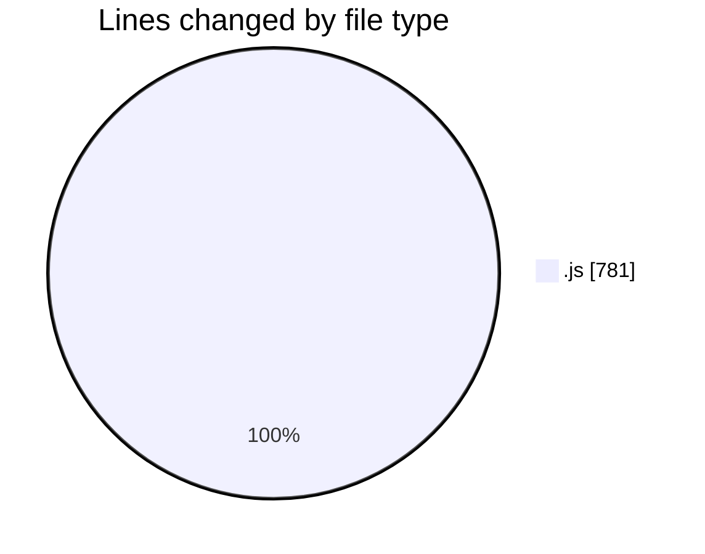
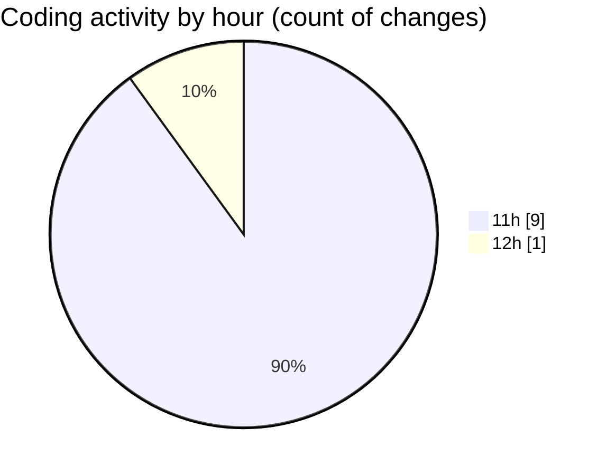

# nxtqube_webapp - Activity Summary 

## Overall Statistics

| Stat                   | Value                                                             |
| ---------------------- | ----------------------------------------------------------------- |
| **Lines Added** (➕)   | 652                                          |
| **Lines Removed** (➖) | 129                                        |
| **Net Change** (↕)    | 523                |
| **Active Time** (⌚)   | 10 minutes |

## Modified Files
- **mission.controller.js** (+452, -129)
- **mission.route.js** (+35, -0)
- **routes.js** (+95, -0)
- **mission.validator.js** (+70, -0)

## Visualizations

### By File Type (Lines Changed)

### By Hour (Estimated Activity Count)

> **Last Updated:** 02/11/2025, 12:29:44