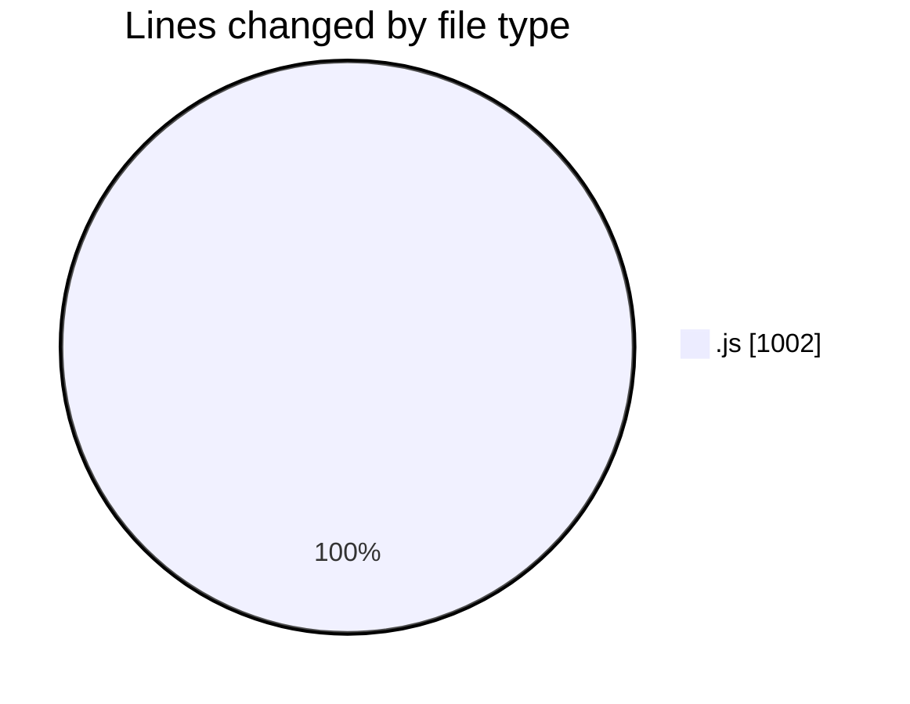
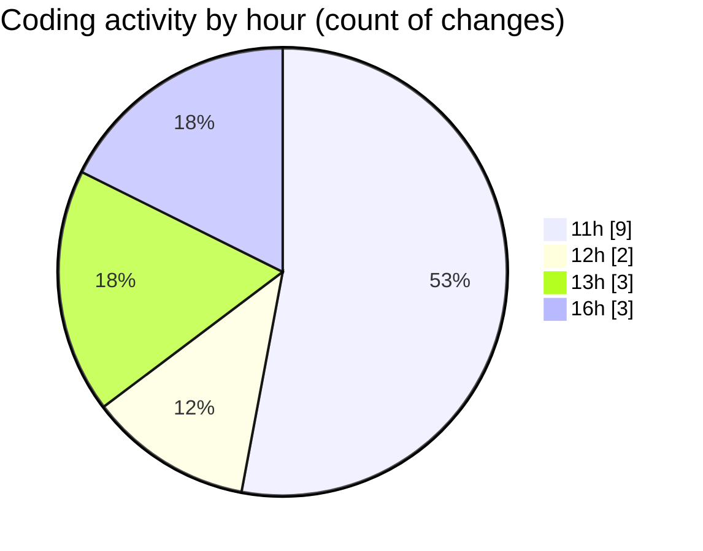

# nxtqube_webapp - Activity Summary 

## Overall Statistics

| Stat                   | Value                                                             |
| ---------------------- | ----------------------------------------------------------------- |
| **Lines Added** (➕)   | 843                                          |
| **Lines Removed** (➖) | 159                                        |
| **Net Change** (↕)    | 684                |
| **Active Time** (⌚)   | 15 minutes |

## Modified Files
- **mission.controller.js** (+453, -137)
- **mission.route.js** (+111, -10)
- **routes.js** (+95, -0)
- **mission.validator.js** (+184, -12)

## Visualizations

### By File Type (Lines Changed)

### By Hour (Estimated Activity Count)

> **Last Updated:** 02/11/2025, 16:43:34