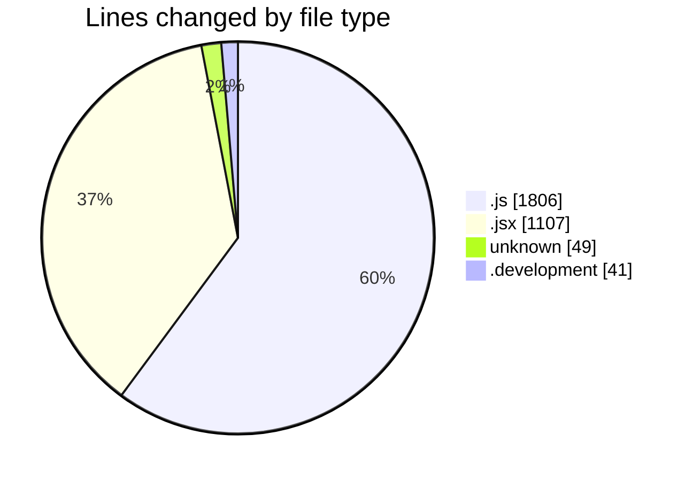
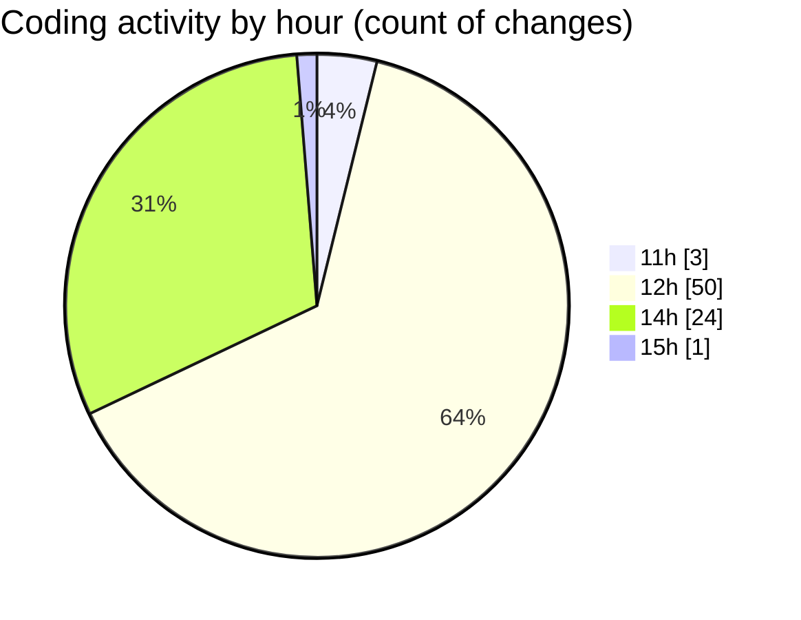

# nxtqube_webapp - Activity Summary 

## Overall Statistics

| Stat                   | Value                                                             |
| ---------------------- | ----------------------------------------------------------------- |
| **Lines Added** (➕)   | 2297                                          |
| **Lines Removed** (➖) | 706                                        |
| **Net Change** (↕)    | 1591                |
| **Active Time** (⌚)   | 120 minutes |

## Modified Files
- **mission.controller.js** (+479, -133)
- **12.site.seeder.js** (+23, -0)
- **mission.route.js** (+261, -170)
- **routes.js** (+130, -37)
- **auth.middleware.js** (+96, -12)
- **site.routes.js** (+153, -62)
- **site.controller.js** (+119, -12)
- **webhook.route.js** (+87, -32)
- **createFlow.jsx** (+451, -131)
- **env** (+41, -8)
- **.env.development** (+41, -0)
- **Drone.jsx** (+56, -25)
- **Flinklogs.jsx** (+260, -38)
- **MissionControl.jsx** (+100, -46)

## Visualizations

### By File Type (Lines Changed)

### By Hour (Estimated Activity Count)

> **Last Updated:** 03/11/2025, 15:55:12