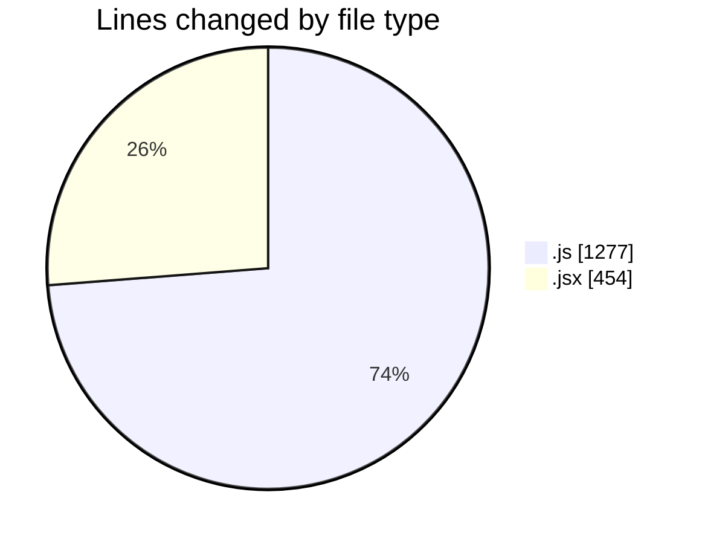
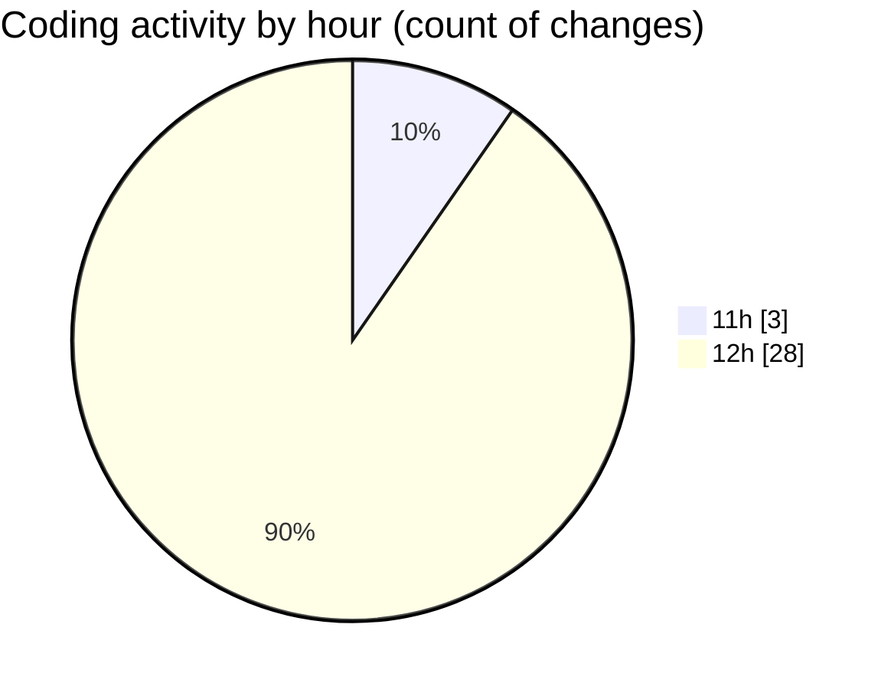

# nxtqube_webapp - Activity Summary 

## Overall Statistics

| Stat                   | Value                                                             |
| ---------------------- | ----------------------------------------------------------------- |
| **Lines Added** (➕)   | 1462                                          |
| **Lines Removed** (➖) | 269                                        |
| **Net Change** (↕)    | 1193                |
| **Active Time** (⌚)   | 33 minutes |

## Modified Files
- **mission.controller.js** (+457, -71)
- **12.site.seeder.js** (+23, -0)
- **mission.route.js** (+101, -73)
- **routes.js** (+95, -2)
- **auth.middleware.js** (+90, -6)
- **site.routes.js** (+122, -31)
- **site.controller.js** (+113, -6)
- **webhook.route.js** (+71, -16)
- **createFlow.jsx** (+390, -64)

## Visualizations

### By File Type (Lines Changed)

### By Hour (Estimated Activity Count)

> **Last Updated:** 03/11/2025, 12:33:36