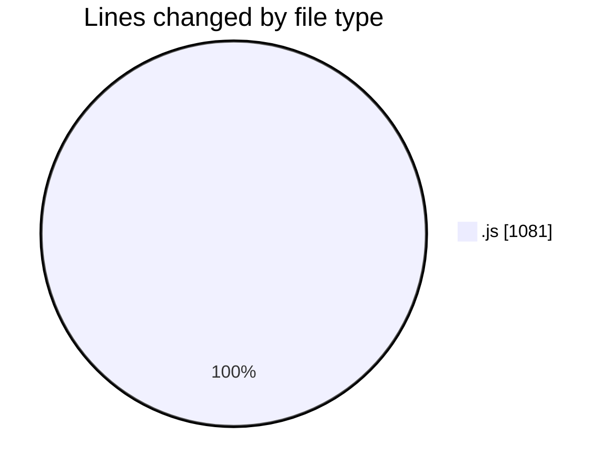
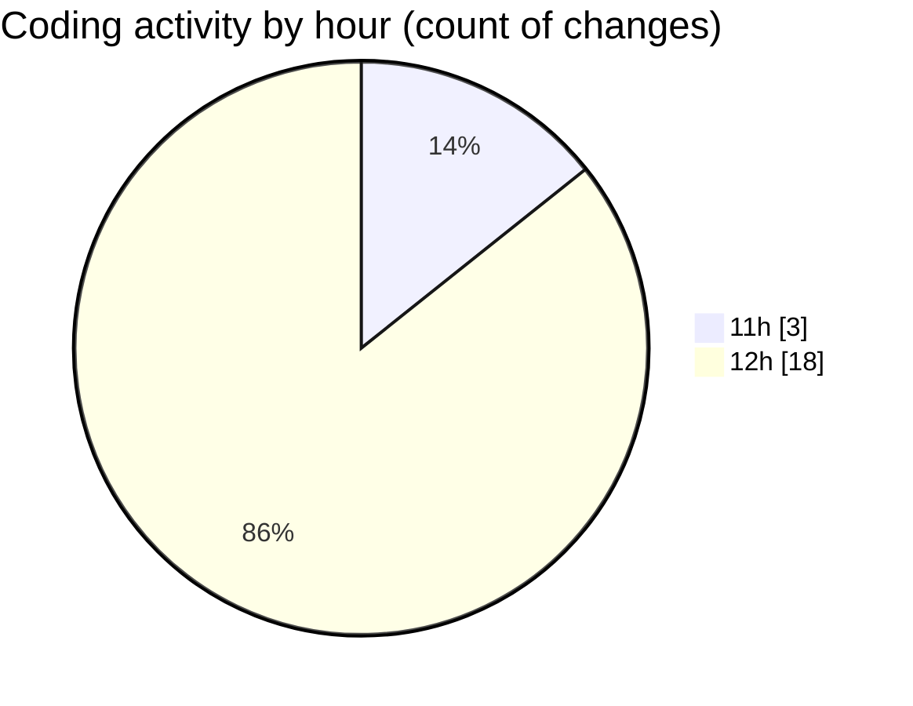

# nxtqube_webapp - Activity Summary 

## Overall Statistics

| Stat                   | Value                                                             |
| ---------------------- | ----------------------------------------------------------------- |
| **Lines Added** (➕)   | 957                                          |
| **Lines Removed** (➖) | 124                                        |
| **Net Change** (↕)    | 833                |
| **Active Time** (⌚)   | 16 minutes |

## Modified Files
- **mission.controller.js** (+395, -71)
- **12.site.seeder.js** (+23, -0)
- **mission.route.js** (+101, -0)
- **routes.js** (+95, -0)
- **auth.middleware.js** (+84, -6)
- **site.routes.js** (+91, -31)
- **site.controller.js** (+113, -0)
- **webhook.route.js** (+55, -16)

## Visualizations

### By File Type (Lines Changed)

### By Hour (Estimated Activity Count)

> **Last Updated:** 03/11/2025, 12:28:36