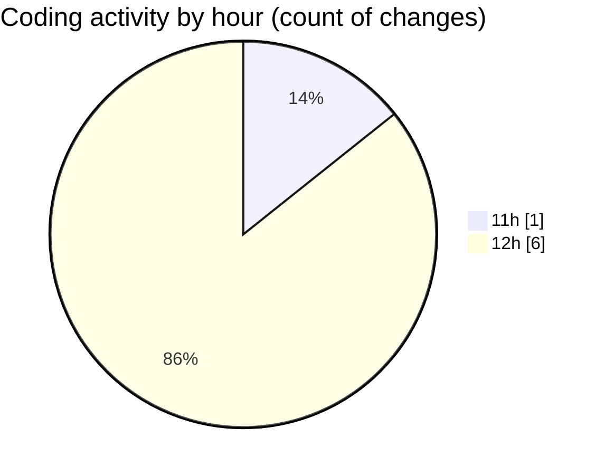

# nxtqube_webapp - Activity Summary 

## Overall Statistics

| Stat                   | Value                                                             |
| ---------------------- | ----------------------------------------------------------------- |
| **Lines Added** (➕)   | 554                                          |
| **Lines Removed** (➖) | 4                                        |
| **Net Change** (↕)    | 550                |
| **Active Time** (⌚)   | 3 minutes |

## Modified Files
- **fenceData.controller.js** (+367, -2)
- **geofencedock.controller.js** (+78, -2)
- **fence.validator.js** (+109, -0)

## Visualizations

### By File Type (Lines Changed)

### By Hour (Estimated Activity Count)

> **Last Updated:** 04/11/2025, 12:50:22